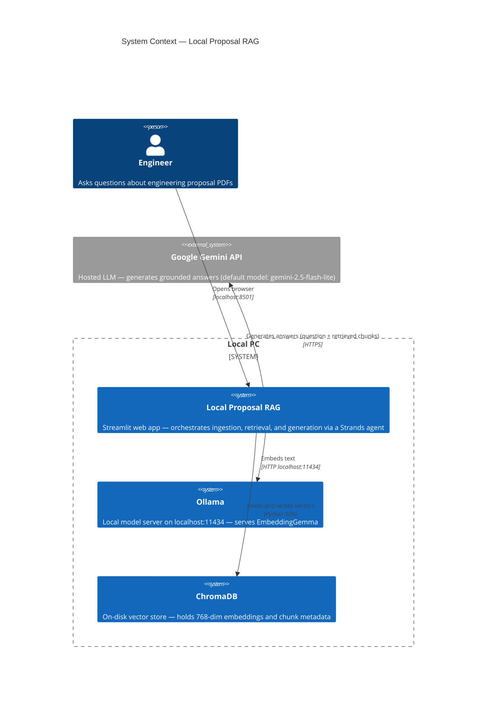
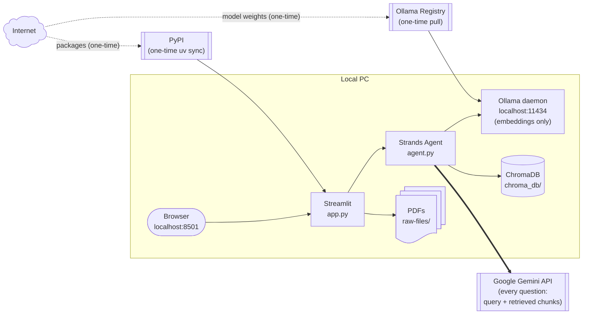

# Local Proposal RAG — Documentation

A Retrieval-Augmented Generation (RAG) application for querying engineering proposal PDFs, powered by **Strands Agents**. Embeddings and the vector store run on-device; only the user question and the top retrieved chunks are sent to the hosted **Google Gemini API** for answer generation.

| | |
|---|---|
| **Embedding model** | `embeddinggemma` (300M params, 768-dim, via Ollama — runs on-device) |
| **Generation model** | `gemini-2.5-flash-lite` (default; via the hosted Google Gemini API) — `gemini-2.5-flash` is a higher-quality option, `gemini-2.5-pro` is the highest-quality option. Override with the `GEMINI_MODEL` env var. |
| **Vector store** | ChromaDB (persistent, on-disk) |
| **Agent SDK** | Strands Agents |
| **UI** | Streamlit (`localhost:8501`) |
| **Package manager** | uv |

---

## System Context

Ingestion, retrieval, and the embedding model are local. Generation is delegated to the hosted Gemini API — only the user question and the retrieved chunks leave the machine.



---

## Documents

| File | What it covers |
|---|---|
| [architecture.md](architecture.md) | Container diagram and service topology |
| [ingestion.md](ingestion.md) | PDF-to-vector pipeline (flowchart + sequence) |
| [query-flow.md](query-flow.md) | End-to-end query and answer sequence via Strands |
| [setup.md](setup.md) | First-time setup decision tree and command reference |
| [gemini-api-key.md](gemini-api-key.md) | How to obtain, install, and rotate a Google Gemini API key |

---

## Quick Start

> Prerequisites: Ollama installed, `embeddinggemma` pulled, a Gemini API key in `.env`, and uv installed. See [setup.md](setup.md) and [gemini-api-key.md](gemini-api-key.md).

```powershell
# From Local-RAG/
uv sync                              # rebuild .venv from pyproject.toml
uv run streamlit run app.py          # open http://localhost:8501
```

Then click **Re-ingest PDFs** in the sidebar once to index all PDFs in `raw-files/`.

---

## Project Layout

```
Local-RAG/
├── app.py            # Streamlit UI
├── ingest.py         # Ingestion pipeline
├── rag.py            # Retrieval (embedding + ChromaDB lookup)
├── agent.py          # Strands Agent — search_documents tool + agent factory
├── pyproject.toml    # uv project definition
├── uv.lock           # Reproducible lockfile
├── chroma_db/        # ChromaDB data (git-ignored)
├── raw-files/        # Source PDFs (git-ignored)
├── .venv/            # uv-managed venv (git-ignored)
└── docs/             # This documentation
    ├── README.md         # Hub — points here and to theory/
    ├── implementation/   # You are here
    │   ├── README.md
    │   ├── architecture.md
    │   ├── ingestion.md
    │   ├── query-flow.md
    │   └── setup.md
    └── theory/           # General RAG / ecosystem reference
```

---

## Privacy and Network Boundaries


