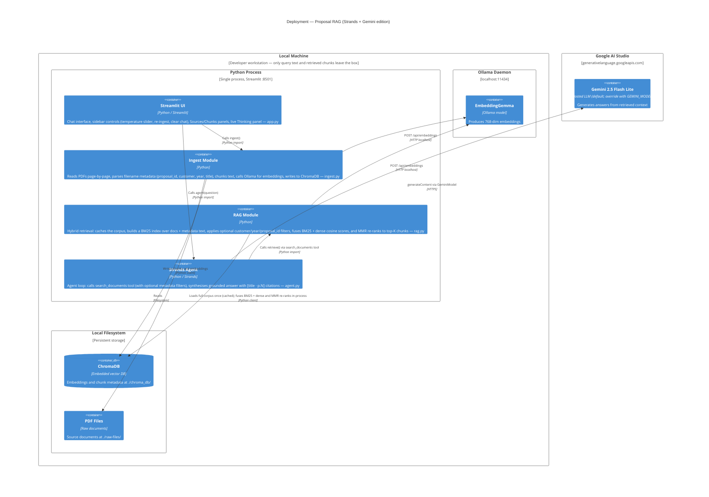
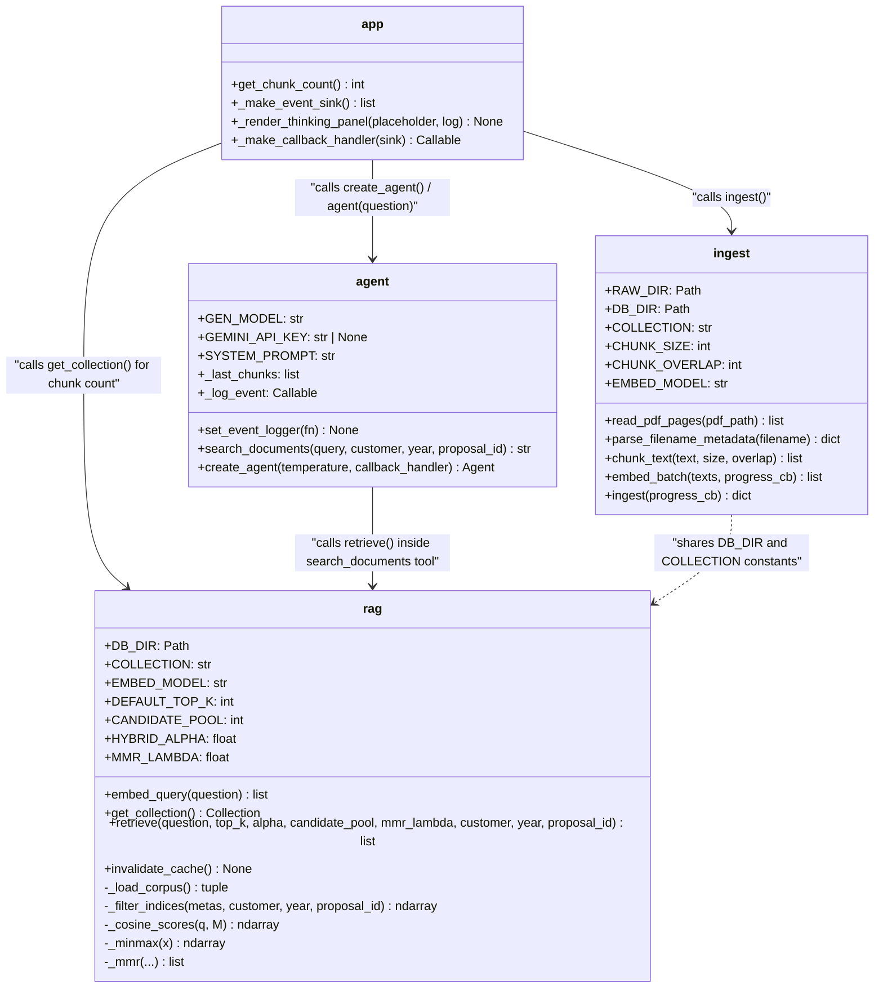
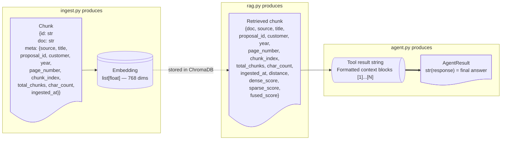

# Architecture

---

## Containers

Embeddings and the vector store run on a single developer workstation. Generation is delegated to the hosted **Google Gemini API** — only the user question and the retrieved chunks ever leave the machine.



---

## Service Topology

End-to-end flows for ingestion (one-time setup) and query (every question). Both flows share the same Ollama embedding endpoint and ChromaDB collection.

```mermaid
sequenceDiagram
    accTitle: Local RAG service topology — ingestion and query flows
    accDescr: Ingestion embeds PDFs and stores them in ChromaDB. The query flow runs via the Strands agent which calls the search_documents tool then generates a grounded answer.

    actor Engineer
    participant UI as Streamlit UI
    participant Ingest as Ingest Module
    participant Agent as Strands Agent
    participant RAG as RAG Module
    participant Embed as EmbeddingGemma<br/>(Ollama)
    participant DB as ChromaDB
    participant LLM as Gemini 2.5 Flash Lite<br/>(AI Studio)

    rect rgb(240, 248, 255)
        note over Engineer,DB: Ingestion flow (one-time / on demand)
        Engineer->>UI: Click "Re-ingest PDFs"
        UI->>Ingest: ingest()
        Ingest->>Ingest: Read & chunk PDF files
        Ingest->>Embed: POST /api/embeddings (chunks)
        Embed-->>Ingest: Embedding vectors
        Ingest->>DB: Write chunks + embeddings
    end

    rect rgb(240, 255, 240)
        note over Engineer,LLM: Query flow (every question)
        Engineer->>UI: Ask a question
        UI->>Agent: agent(question)
        Agent->>LLM: Initial reasoning turn
        LLM-->>Agent: Tool call: search_documents(query)
        Agent->>RAG: retrieve(query, top_k=20)
        RAG->>Embed: POST /api/embeddings (query)
        Embed-->>RAG: Query embedding
        RAG->>RAG: Score corpus: BM25 + cosine, fuse, MMR re-rank
        Note right of RAG: Corpus + BM25 index<br/>cached after first call;<br/>invalidated by re-ingest
        RAG-->>Agent: Top-20 diverse chunks
        Agent->>LLM: generateContent (context + question)
        LLM-->>Agent: Generated answer
        Agent-->>UI: AgentResult
        UI-->>Engineer: Display answer and sources
    end
```

---

## Module Responsibilities



---

## Data Shapes

The key data structures that flow between modules.


