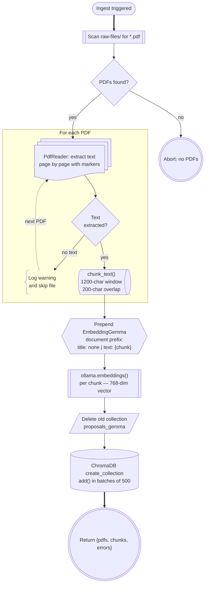
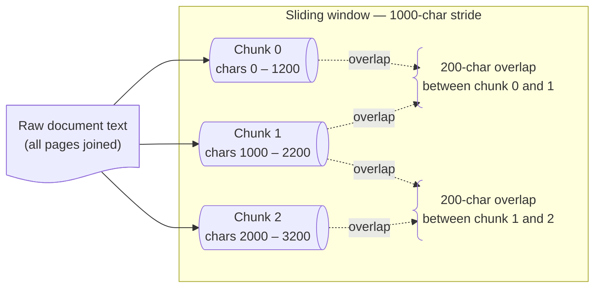
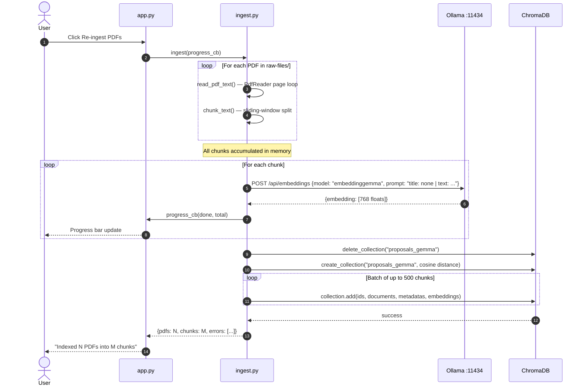

# Ingestion Pipeline

The ingestion pipeline converts raw PDF files into searchable embeddings stored in ChromaDB. It runs on-demand via the **Re-ingest PDFs** button and always rebuilds the collection from scratch.

---

## Pipeline Stages

Four stages from raw files to indexed vectors. The embedding stage processes all chunks collected across every PDF before touching ChromaDB.

---

## Chunking Strategy

Overlapping windows preserve context that would otherwise be split at a boundary.

---

## EmbeddingGemma Prompt Prefixes

EmbeddingGemma uses task-specific prompt prefixes to optimize embedding quality. The ingestion pipeline uses the **document** prefix; the query pipeline uses the **query** prefix. Using mismatched prefixes degrades retrieval quality.

| Context | Prefix | Used in |
|---|---|---|
| Document (ingestion) | `title: none \| text: {chunk}` | `ingest.py → _doc_prompt()` |
| Query (retrieval) | `task: question answering \| query: {question}` | `rag.py → embed_query()` |

---

## Ingestion Sequence

Detailed call flow from the Streamlit button click through Ollama and into ChromaDB.

---

## Key Constants

| Constant | Value | Reason |
|---|---|---|
| `CHUNK_SIZE` | 1200 chars | ≈ 300–400 tokens — safely under EmbeddingGemma's 2048-token input limit |
| `CHUNK_OVERLAP` | 200 chars | Preserves sentence context across chunk boundaries |
| `EMBED_MODEL` | `embeddinggemma` | 768-dim output; purpose-built for retrieval |
| `COLLECTION` | `proposals_gemma` | Separate from the old `proposal_docs` collection (different vector dim: 768 vs 384) |
| Batch size | 500 | Below ChromaDB's default per-call item limit |
