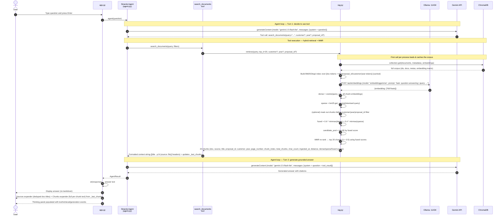
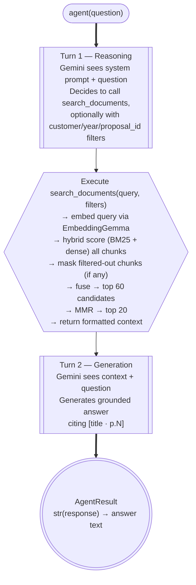
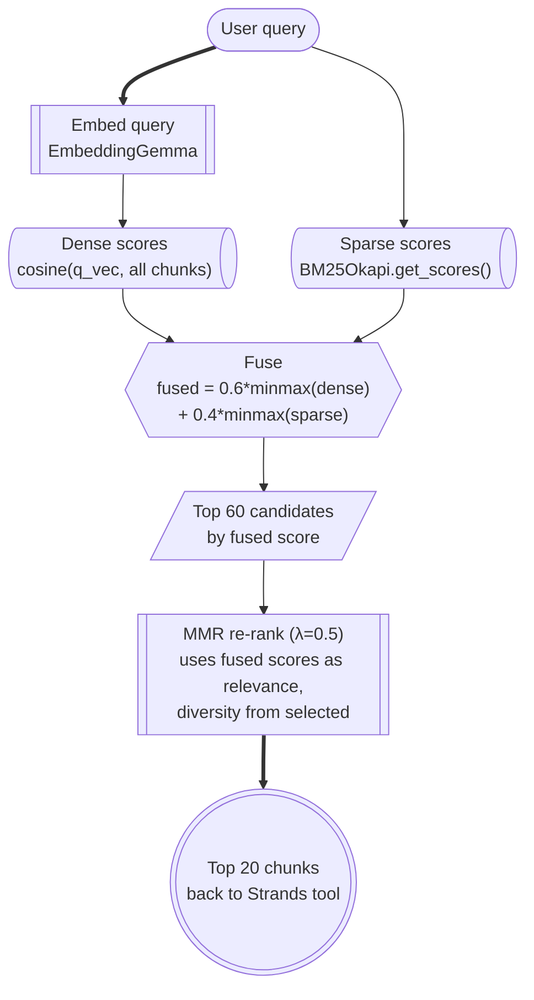
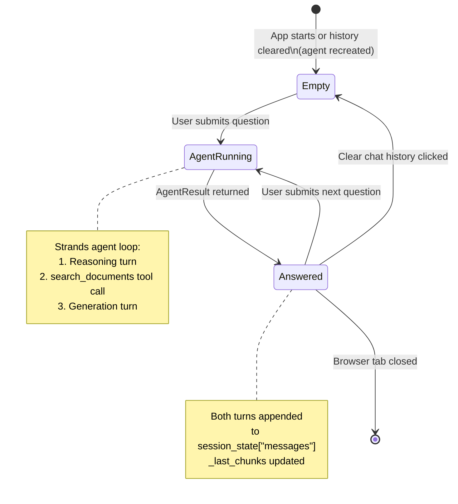

# Query and Answer Flow

Every question submitted to the app goes through a **Strands Agent loop**: the agent decides to call the `search_documents` tool, receives the retrieved context, then generates a grounded answer. Retrieval (embeddings + ChromaDB) runs on-device; generation calls out to the **Gemini API**.

Retrieval is **hybrid**: BM25 (keyword) and dense (EmbeddingGemma cosine) scores are min-max normalised and fused. **MMR** then picks the top 20 from the top-60 candidates to balance precision against diversity across source PDFs. The agent can also pass **metadata filters** (`customer`, `year`, `proposal_id`) which restrict the corpus *before* scoring.

---

## End-to-End Sequence

---

## Agent Loop

The Strands agent orchestrates multi-turn reasoning. For a typical RAG question this is two turns: one to decide to retrieve, one to generate the answer.

---

## Retrieval Distance

The `distance` field surfaced in the UI is `1 - cosine_similarity` (lower = more similar) so it stays comparable to the old Chroma-only behaviour. The hybrid retriever also exposes the raw `dense_score`, `sparse_score`, and `fused_score` for diagnostics.

| Distance range | Interpretation |
|---|---|
| `0.00 – 0.15` | Very strong match — likely the exact answer |
| `0.15 – 0.35` | Good match — relevant context |
| `0.35 – 0.55` | Weak match — tangentially related |
| `> 0.55` | Poor match — may introduce noise |

Note that with hybrid + MMR enabled, a chunk can land in the top 20 because of a strong **BM25** keyword hit even if its dense distance is mediocre — inspect `sparse_score` and `fused_score` if the `distance` value alone looks surprising.

---

## Hybrid Retrieval + MMR

`rag.retrieve()` runs five steps per query, all in-process after the corpus is loaded once.

### Why hybrid?

- **Dense (EmbeddingGemma cosine)** is great at semantic paraphrase ("what does it cost?" ↔ "net price is…") but weak on rare tokens like proposal IDs (`P-118231-24C`), part numbers, and customer names.
- **BM25** is the opposite: it loves exact tokens but ignores meaning. Together they cover each other's blind spots.
- The BM25 index is built over **document tokens + filename-derived metadata tokens** (`title`, `proposal_id`, `customer`, `year`). This way a query like *"Hexcel proposal cost"* gets a strong sparse score on every chunk of the Hexcel PDF even if the word "Hexcel" never appears in the body text.
- Fusion happens on min-max normalised scores so neither retriever dominates by virtue of using a different scale.

### Why MMR?

The top-N nearest neighbours of any business-style query tend to collapse onto cover letters and boilerplate from one or two PDFs (high cosine similarity to almost any prompt). **Maximal Marginal Relevance** greedily picks the most relevant candidate that is *least* similar to what's already been picked, spreading the final 20 chunks across multiple source documents.

---

## Metadata Filters

`search_documents` accepts three optional arguments that the agent can populate from the user's question:

| Argument | Type | Match style | Example query |
|---|---|---|---|
| `customer` | string | case-insensitive substring | *"What did we quote Hexcel?"* → `customer="Hexcel"` |
| `year` | string | exact 4-digit year | *"Show me 2025 proposals about ovens"* → `year="2025"` |
| `proposal_id` | string | exact match | *"Summarise P-118231-24C"* → `proposal_id="P-118231-24C"` |

Filters are applied in `rag.retrieve()` *before* score fusion: non-matching chunks have their dense score forced to `-inf` and are dropped from the candidate pool. If every chunk is filtered out the tool returns the no-results sentinel and the system prompt instructs the model to say so.

---

## Corpus Cache

Hybrid retrieval needs the full corpus (documents + metadata + embeddings + BM25 index) in memory. `rag._load_corpus()` is wrapped in `functools.lru_cache(maxsize=1)` so it loads once per process. `ingest.ingest()` calls `rag.invalidate_cache()` on success so the next query reloads the freshly written collection.

---

## Chat Session Lifecycle

The Strands agent is stored in `st.session_state["strands_agent"]` so its internal conversation history persists across Streamlit reruns. Clearing chat history destroys the agent and creates a fresh one.

---

## Generation Parameters

The Strands `GeminiModel` is configured per session via `create_agent(temperature=...)`. Temperature is exposed in the Streamlit sidebar as a live slider (default `0.20`); changing it rebuilds the agent.

| Parameter | Default | Notes |
|---|---|---|
| `temperature` | `0.20` | Sidebar slider (`0.00–1.50`); rebuilds the agent on change and resets model conversation memory |
| Model | `gemini-2.5-flash-lite` (default) — `gemini-2.5-flash` is higher-quality; `gemini-2.5-pro` is the highest-quality option | Set `GEMINI_MODEL` in `.env` (overrides the fallback in `agent.py`) |
| API key | from `GEMINI_API_KEY` (or `GOOGLE_API_KEY`) env var | Loaded via `python-dotenv` from `.env` if present |
| Tool `top_k` chunks | `20` | Hardcoded in `search_documents` tool body — increased from 4 now that hybrid + MMR keeps the pool diverse |
| `HYBRID_ALPHA` | `0.6` | rag.py — weight on dense vs. BM25 in fusion (1.0 = pure dense, 0.0 = pure BM25) |
| `CANDIDATE_POOL` | `60` | rag.py — number of chunks fed into MMR |
| `MMR_LAMBDA` | `0.5` | rag.py — 1.0 = pure relevance, 0.0 = pure diversity |
| Citation format | `[title · p.PAGE]` | Enforced by `SYSTEM_PROMPT` in agent.py |
