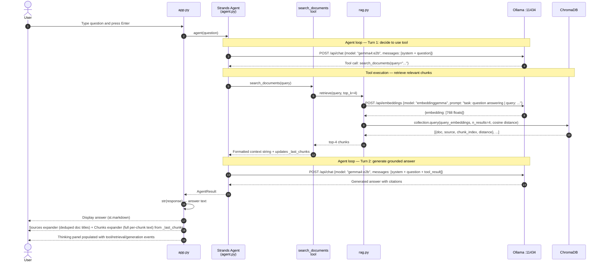
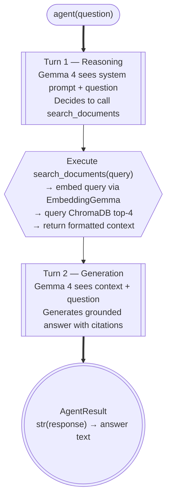
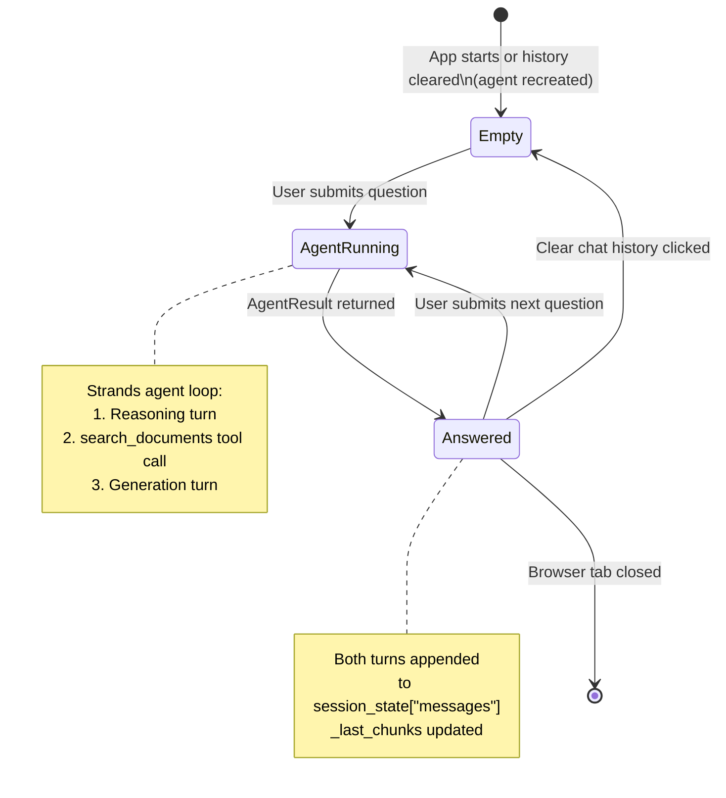

# Query and Answer Flow

Every question submitted to the app goes through a **Strands Agent loop**: the agent decides to call the `search_documents` tool, receives the retrieved context, then generates a grounded answer — all on-device via Ollama and ChromaDB.

---

## End-to-End Sequence

---

## Agent Loop

The Strands agent orchestrates multi-turn reasoning. For a typical RAG question this is two turns: one to decide to retrieve, one to generate the answer.

---

## Retrieval Distance

ChromaDB uses cosine distance. Lower values mean higher similarity.

| Distance range | Interpretation |
|---|---|
| `0.00 – 0.15` | Very strong match — likely the exact answer |
| `0.15 – 0.35` | Good match — relevant context |
| `0.35 – 0.55` | Weak match — tangentially related |
| `> 0.55` | Poor match — may introduce noise |

The Sources expander shows the distance for each retrieved chunk so you can judge relevance at a glance.

---

## Chat Session Lifecycle

The Strands agent is stored in `st.session_state["strands_agent"]` so its internal conversation history persists across Streamlit reruns. Clearing chat history destroys the agent and creates a fresh one.

---

## Generation Parameters

The Strands `OllamaModel` is configured per session via `create_agent(temperature=...)`. Temperature is exposed in the Streamlit sidebar as a live slider (default `0.20`); changing it rebuilds the agent.

| Parameter | Default | Notes |
|---|---|---|
| `temperature` | `0.20` | Sidebar slider (`0.00–1.50`); rebuilds the agent on change and resets model conversation memory |
| `top_p` | Ollama default | Configurable via `OllamaModel` kwargs |
| Model | `gemma4:e2b` | Change `GEN_MODEL` in `agent.py` |
| Tool `top_k` chunks | `4` | Hardcoded in `search_documents` tool body |
