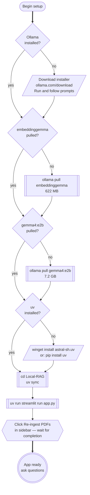
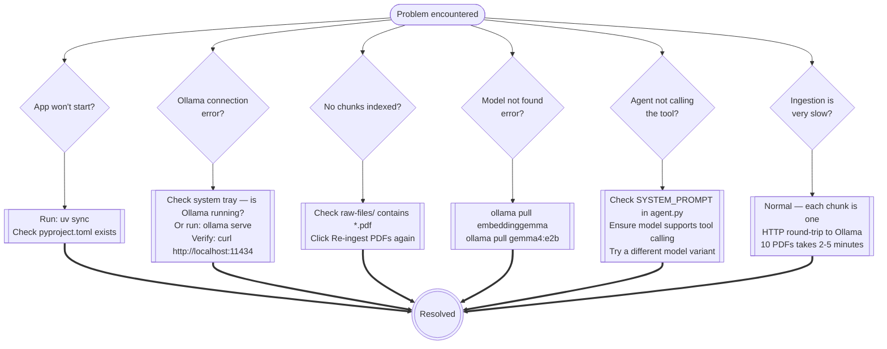

# Setup and Operations

---

## First-Time Setup

Follow the decision tree to get from zero to a running app.



---

## Command Reference

### Ollama

```powershell
# Pull models (one-time)
ollama pull embeddinggemma        # 622 MB — embedding model
ollama pull gemma4:e2b            # 7.2 GB — generation model

# Verify models are present
ollama list

# Check what is loaded in VRAM right now
ollama ps

# Smoke-test generation
ollama run gemma4:e2b "What is RAG? One sentence."
```

### uv (from `Local-RAG/`)

```powershell
# Install / restore dependencies from pyproject.toml + uv.lock
uv sync

# Run the app (no activation needed)
uv run streamlit run app.py

# NOTE: Ingestion is triggered from the app sidebar ("Re-ingest PDFs"),
# not from the CLI. `ingest.py` only defines the pipeline; running it
# directly with `uv run python ingest.py` will not produce output or
# create `chroma_db/`.

# Add a new package
uv add package-name

# Show installed packages
uv pip list
```

---

## Model Resource Requirements

```mermaid
quadrantChart
    accTitle: Model size vs quality tradeoff for Gemma 4 variants
    accDescr: Plots each Gemma 4 variant by VRAM requirement and output quality so you can pick the right one for your hardware.

    title Gemma 4 variants — VRAM vs Quality
    x-axis Low VRAM --> High VRAM
    y-axis Lower Quality --> Higher Quality
    quadrant-1 High quality, high VRAM
    quadrant-2 High quality, low VRAM
    quadrant-3 Low quality, low VRAM
    quadrant-4 Low quality, high VRAM
    e2b (this app): [0.35, 0.45]
    e4b (default): [0.45, 0.55]
    26b MoE: [0.65, 0.80]
    31b Dense: [0.85, 0.90]
```

| Model | VRAM | Context | Notes |
|---|---|---|---|
| `embeddinggemma` | ~1 GB | 2K | Always needed; stays loaded |
| `gemma4:e2b` *(this app)* | ~7 GB | 128K | Good balance for laptops |
| `gemma4:e4b` | ~9.6 GB | 128K | Default tag; slightly higher quality |
| `gemma4:26b` | ~18 GB | 256K | MoE — high quality, workstation GPU |
| `gemma4:31b` | ~20 GB | 256K | Dense — top accuracy, 24 GB VRAM |

To switch generation models, change `GEN_MODEL` in [agent.py](../agent.py) and restart the app.

---

## Troubleshooting


