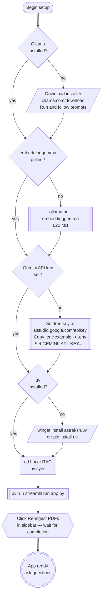
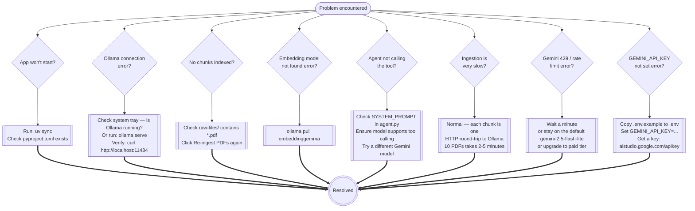

# Setup and Operations

---

## First-Time Setup

Follow the decision tree to get from zero to a running app.



---

## Command Reference

### Ollama

```powershell
# Pull the embedding model (one-time). Generation runs on Gemini, not Ollama.
ollama pull embeddinggemma        # 622 MB — embedding model

# Verify it's present
ollama list

# Check what is loaded in VRAM right now
ollama ps
```

Generation uses the **hosted Gemini API** (free tier on Google AI Studio).
Get a key at <https://aistudio.google.com/apikey> and put it in `.env`:

```powershell
Copy-Item .env.example .env
notepad .env   # set GEMINI_API_KEY=...
```

To switch which Gemini model the app uses, set the `GEMINI_MODEL` env var (in `.env` or your shell) and restart Streamlit — e.g. `GEMINI_MODEL=gemini-2.5-flash`. The fallback in [`agent.py`](../../agent.py) is `gemini-2.5-flash-lite`.

### uv (from `Local-RAG/`)

```powershell
# Install / restore dependencies from pyproject.toml + uv.lock
uv sync

# Run the app (no activation needed)
uv run streamlit run app.py

# NOTE: Ingestion is triggered from the app sidebar ("Re-ingest PDFs"),
# not from the CLI. `ingest.py` only defines the pipeline; running it
# directly with `uv run python ingest.py` will not produce output or
# create `chroma_db/`.

# Add a new package
uv add package-name

# Show installed packages
uv pip list
```

---

## Model Resource Requirements

Only the embedding model runs locally. Generation runs in Google's data centres.

```mermaid
quadrantChart
    accTitle: Gemini model size vs quality tradeoff
    accDescr: Plots each Gemini 2.5 variant by latency / cost vs quality so you can pick the right one for your workload.

    title Gemini 2.5 variants — Cost/latency vs Quality
    x-axis Lower cost / faster --> Higher cost / slower
    y-axis Lower Quality --> Higher Quality
    quadrant-1 High quality, higher cost
    quadrant-2 High quality, low cost
    quadrant-3 Low quality, low cost
    quadrant-4 Low quality, high cost
    flash-lite (this app): [0.20, 0.45]
    flash: [0.45, 0.70]
    pro: [0.85, 0.92]
```

| Model | Where it runs | Notes |
|---|---|---|
| `embeddinggemma` | Local via Ollama | Always needed; ~1 GB VRAM, stays loaded |
| `gemini-2.5-flash-lite` *(this app)* | Gemini API | Default — cheapest / fastest, generous free-tier RPM/RPD |
| `gemini-2.5-flash` | Gemini API | Higher quality, lower free-tier RPM/RPD |
| `gemini-2.5-pro` | Gemini API | Highest quality, tightest free-tier RPD |

To switch generation models, set `GEMINI_MODEL` in `.env` (or your shell) and restart the app.

---

## Troubleshooting


