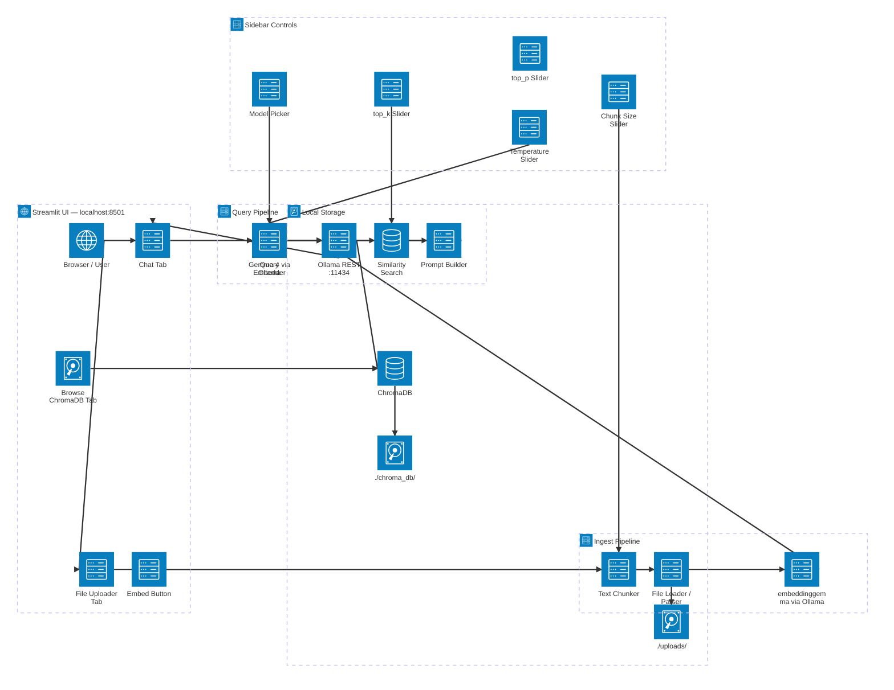
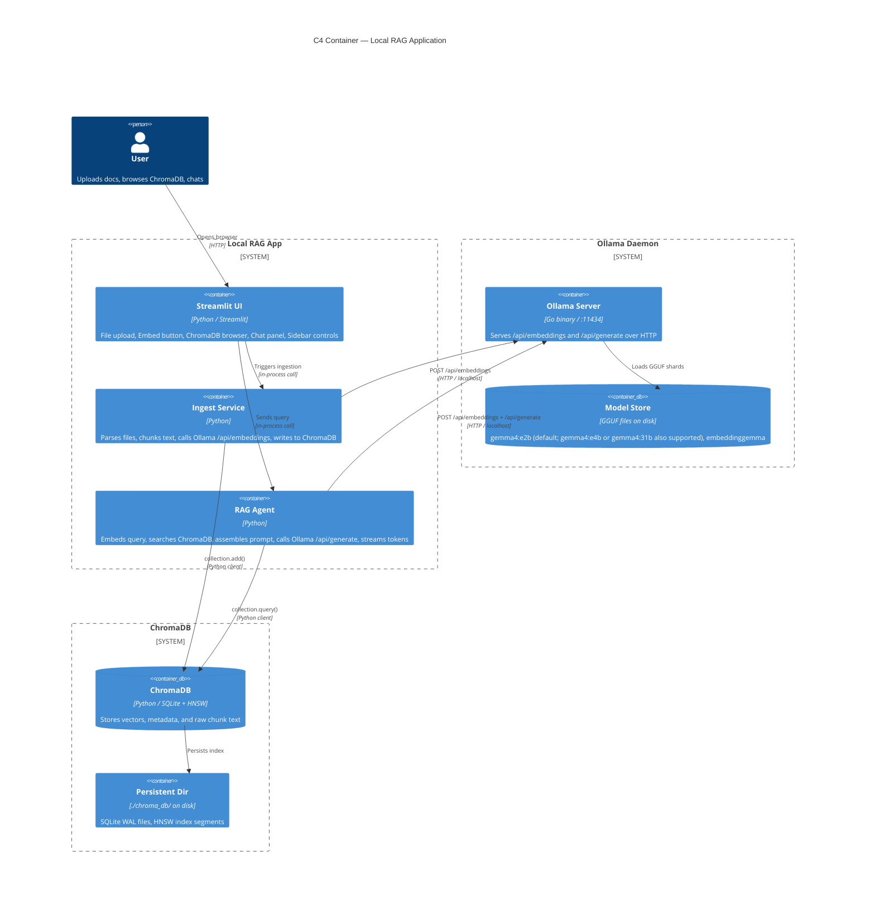

# System Architecture

This page gives you two views of the same system: an **`architecture-beta` topology** (where things live and how data flows) and a **C4 Container diagram** (what each deployable unit does).

---

## Topology Diagram

---

## C4 Container View

---

## Data Flow Narratives

### Ingest Flow

1. User selects one or more files (PDF, Markdown, plain text) in the **File Uploader** tab.
2. The **File Loader** saves raw bytes to `./uploads/` and extracts plain text.
3. The **Chunker** splits text into overlapping windows (chunk size and overlap configurable in the sidebar).
4. Each chunk is sent to **Ollama `/api/embeddings`** with model `embeddinggemma`.
5. The resulting 768-d vectors are written to **ChromaDB** together with metadata (source filename, page number, chunk index).
6. The **Browse ChromaDB** tab in the UI shows the new entries immediately.

### Query Flow

1. User types a question in the **Chat** tab.
2. The question is embedded by `embeddinggemma` via Ollama.
3. ChromaDB performs an **HNSW approximate nearest-neighbour search** and returns the top-k most similar chunks (k is configurable in the sidebar).
4. The **Prompt Builder** wraps the retrieved chunks in a system prompt with citations.
5. Gemma 4 (`gemma4:31b` via Ollama; `gemma4:e2b` is the lightweight alternative) generates an answer using the provided temperature and top_p values from the sidebar.
6. Tokens are streamed back to the **Chat** panel as they are produced.

---

## Sidebar Controls Reference

| Control | Default | Effect |
|---------|---------|--------|
| **Temperature** | `0.2` | Higher → more creative; lower → more deterministic |
| **top_p** | `0.9` | Nucleus sampling threshold |
| **top_k** | `5` | Number of ChromaDB chunks to retrieve |
| **Chunk size** | `512` | Tokens per chunk (approximate) |
| **Chunk overlap** | `64` | Overlap between adjacent chunks |
| **Inference model** | `gemma4:31b` (default) — `gemma4:e2b` for laptops | Any Ollama model tag |
| **Embedding model** | `embeddinggemma` | Any Ollama embedding-capable model |

---

## Next Steps

- [What is RAG? →](what-is-rag.md) — concepts and motivation  
- [Tokens & Embeddings →](../01-foundations/tokens-and-embeddings.md) — the math behind the arrows  
- [Build the App →](../04-build-the-app/01-project-layout.md) — start coding
