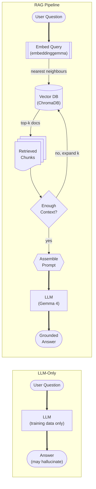
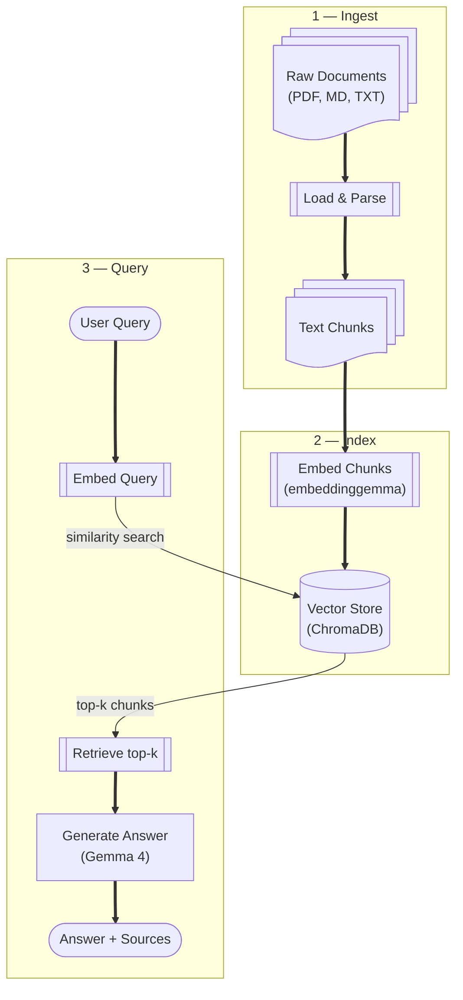

# What is RAG?

Retrieval-Augmented Generation (RAG) lets a language model answer questions about documents it was never trained on by **fetching relevant text at query time** and injecting it into the prompt. This gives you an up-to-date, private knowledge base without fine-tuning a model or sending your data to the cloud.

---

## LLM-Only vs RAG Pipeline

The diagram below contrasts a plain LLM call (left) against a full RAG pipeline (right).

---

## Why RAG Instead of Fine-Tuning?

| Concern | Fine-Tuning | RAG |
|---------|-------------|-----|
| **Data freshness** | Re-train for new docs | Re-index in minutes |
| **Cost** | GPU hours + expertise | Commodity hardware |
| **Privacy** | Model weights encode data | Data stays in your DB |
| **Explainability** | Black-box | Cited source chunks |
| **Scope** | Global knowledge update | Targeted retrieval |

RAG wins when you have **a defined document corpus that changes over time** and you need **verifiable, cited answers**.

---

## The Three Phases

**Phase 1 — Ingest:** Load and parse raw documents into plain text.  
**Phase 2 — Index:** Split text into chunks, embed each chunk into a vector, and store in ChromaDB.  
**Phase 3 — Query:** Embed the user's question, search for the most similar chunks, build a prompt from those chunks, and generate an answer with Gemma 4.

---

## When NOT to Use RAG

- You need the model to **learn new skills** (reasoning patterns, coding style) → fine-tune instead.
- Your corpus is tiny (< 20 short documents) → just stuff the full text in the context window.
- Latency is critical (< 100 ms) → RAG adds retrieval overhead; consider keyword search or caching.

---

## Next Steps

- [Architecture diagram →](architecture.md) — the full system design  
- [Tokens & Embeddings →](../01-foundations/tokens-and-embeddings.md) — how text becomes vectors  
- [Ollama →](../02-ecosystem/ollama.md) — running models locally
