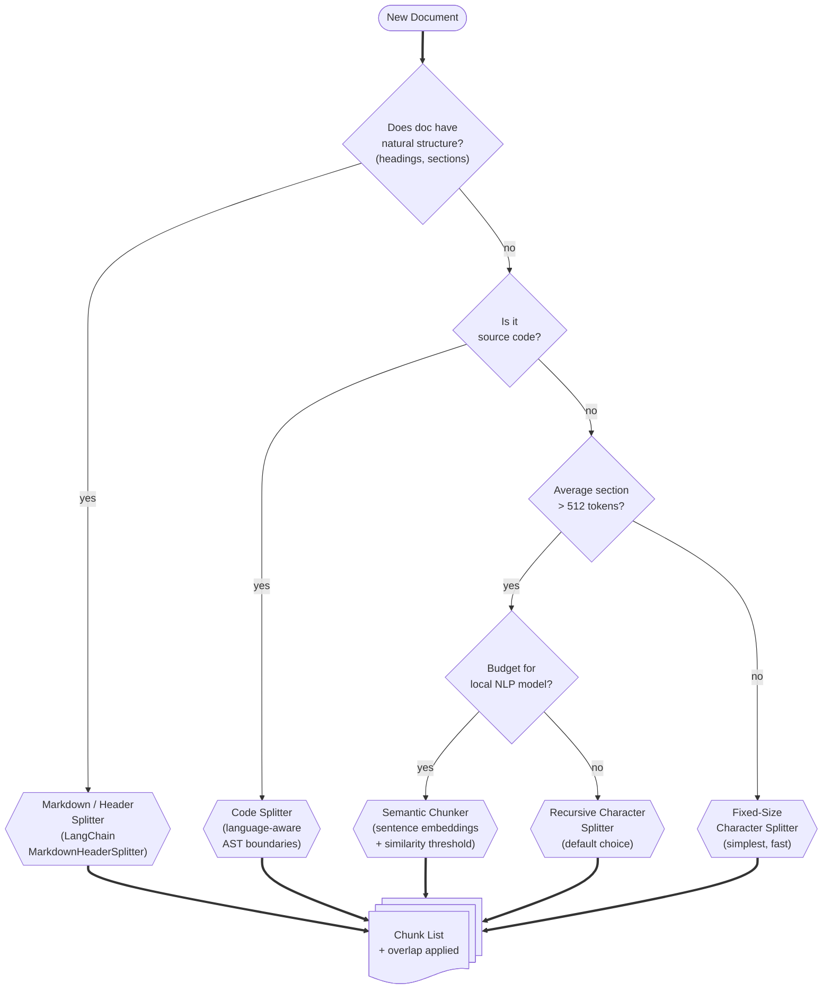
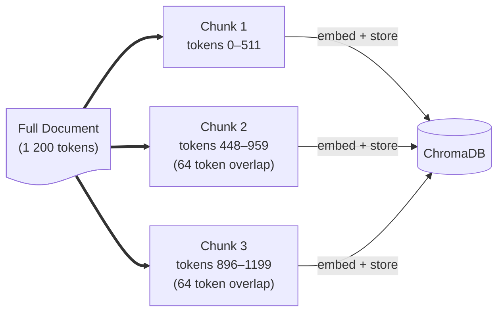

# Chunking Strategies

> **⚠ Smarter chunking — planned but not yet implemented.**
> The shipped `ingest.py` uses a **naive sliding-window character chunker** (1 200 chars / 200 overlap, no token counting, no recursive splitting). The recursive / semantic / token-aware strategies described below are a planned upgrade. The conceptual material in this page is still useful background for that work.

Before you can embed a document you must split it into **chunks** — pieces small enough to fit in the embedding model's context window yet large enough to carry useful meaning. The chunking strategy you choose directly affects retrieval quality.

---

## Decision Tree



---

## Strategy Comparison

| Strategy | Best for | Pros | Cons |
|----------|----------|------|------|
| **Fixed-size** | Quick prototypes, uniform text | Fast, simple | Breaks mid-sentence |
| **Recursive character** | General prose | Tries paragraph → sentence → word boundaries | No semantic awareness |
| **Markdown / Header** | README files, wikis | Preserves section context | Requires heading structure |
| **Code** | Source code | Respects function / class boundaries | Language-specific |
| **Semantic** | High-quality retrieval | Splits at topic shifts | Slow, needs embedding model |

---

## Overlap Explained



Overlap ensures that a sentence split across two chunk boundaries is fully represented in at least one chunk. A common setting is **10–15 % overlap** (e.g., 64 tokens overlap on 512-token chunks).

---

## Implementing Recursive Chunking in Python

```python
from langchain_text_splitters import RecursiveCharacterTextSplitter
from transformers import AutoTokenizer

tokenizer = AutoTokenizer.from_pretrained("google/embeddinggemma-300m")

def token_length(text: str) -> int:
    return len(tokenizer.encode(text, add_special_tokens=False))

splitter = RecursiveCharacterTextSplitter(
    chunk_size=512,          # in tokens
    chunk_overlap=64,
    length_function=token_length,
    separators=["\n\n", "\n", ". ", " ", ""],
)

chunks: list[str] = splitter.split_text(document_text)
```

> Always pass a **token-counting** `length_function` rather than the default character counter. This prevents chunks from silently exceeding the embedding model's 2 048-token limit.

---

## Effect of Chunk Size on Retrieval

| Chunk size | Precision | Recall | Notes |
|------------|-----------|--------|-------|
| **128 tokens** | High | Low | Pinpoint facts; misses multi-sentence context |
| **512 tokens** | Balanced | Balanced | Good default |
| **1024 tokens** | Low | High | Rich context; noisy retrieval |
| **2048 tokens** | Very low | Very high | Rarely useful; approaches full-doc retrieval |

For most RAG use-cases **512 tokens with 64 overlap** is the recommended starting point. Tune with the Streamlit sidebar and measure with the [eval harness](../05-operations/evaluating-rag.md).

---

## Next Steps

- [Tokens & Embeddings →](tokens-and-embeddings.md) — token counting in depth  
- [Ingestion Pipeline →](../04-build-the-app/02-ingestion-pipeline.md) — wiring the chunker into the app  
- [Evaluating RAG →](../05-operations/evaluating-rag.md) — measuring retrieval quality
