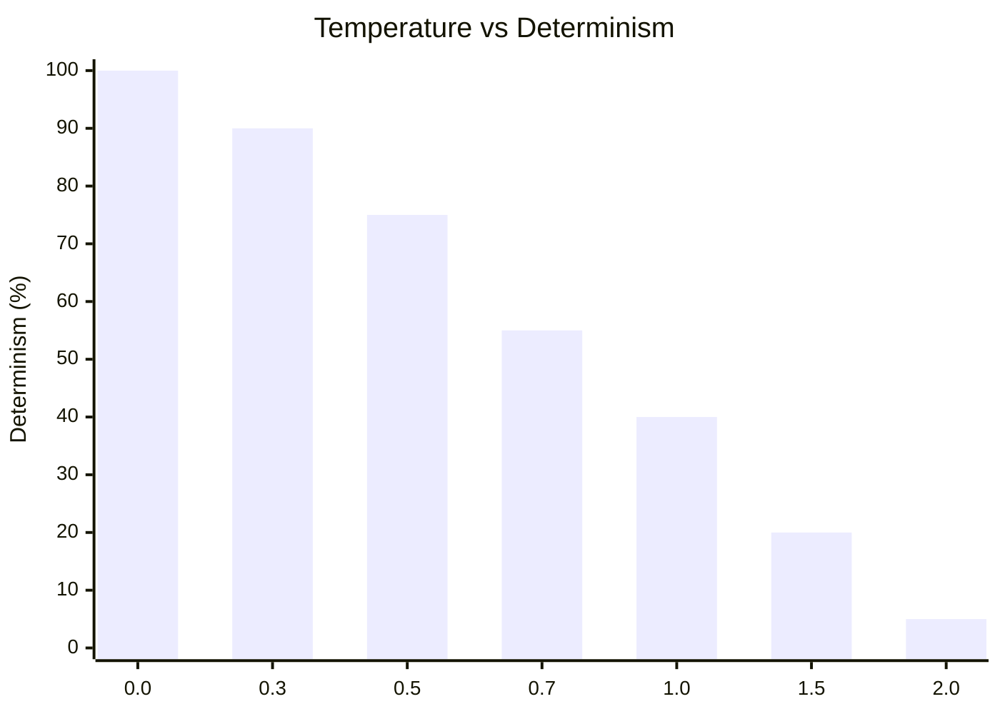
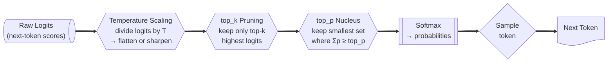
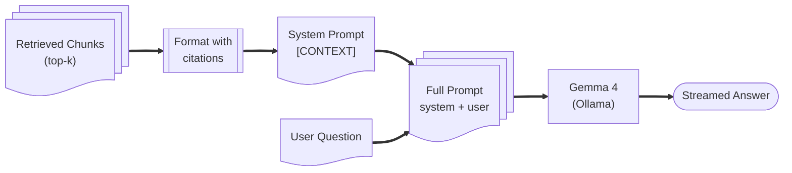

# Prompting and Temperature

**Sampling parameters** control how Gemma 4 picks the next token at each step — from perfectly deterministic to wildly creative. Getting these right is the difference between a focused, factual RAG agent and one that hallucinates confidently.

---

## Temperature vs Determinism



| Temperature | Behaviour | Use for |
|-------------|-----------|---------|
| `0.0` | Always picks highest-probability token | Factual Q&A, structured output |
| `0.1–0.4` | Near-deterministic, slight variation | RAG over technical docs |
| `0.5–0.7` | Balanced | General chat, summaries |
| `0.8–1.0` | Creative, varied phrasing | Brainstorming, writing |
| `> 1.0` | Random, often incoherent | Experimental only |

> **Recommended for RAG:** `temperature = 0.2` keeps answers grounded in the retrieved chunks.

---

## How Sampling Parameters Shape Generation



### Parameter Definitions

**`temperature`** — Divides all logits before softmax. Values < 1 sharpen the distribution (model is more decisive); values > 1 flatten it.

**`top_k`** — After temperature scaling, discard all tokens except the top-k by logit value. Prevents the model from randomly picking low-probability tokens. Common value: `40`.

**`top_p`** (nucleus sampling) — Keep the smallest set of tokens whose cumulative probability ≥ `top_p`. Adapts the candidate set size to the distribution shape. Common value: `0.9`.

**`repeat_penalty`** — Penalises tokens already generated, reducing loops. Default `1.1` is safe.

> The three parameters **stack**: temperature first, then top_k, then top_p. If top_k = 1 the others are irrelevant.

---

## System Prompts for RAG

A well-crafted system prompt tells Gemma 4 to stay grounded in the retrieved context.

```python
SYSTEM_PROMPT = """You are a helpful assistant. Answer the user's question using ONLY
the context passages below. If the context does not contain enough information, say
"I don't have enough information in the provided documents."

Do NOT use prior knowledge. Cite the source document and chunk index for every claim.

Context:
{context}
"""
```



---

## Context Window Budgeting

Gemma 4 supports up to **128K tokens** (E2B/E4B variants). In practice, for RAG:

- Reserve ~512 tokens for the system prompt template.
- Allocate `top_k × chunk_size` tokens for retrieved context.
- Leave the rest for the answer (Gemma 4 stops when it reaches `num_predict`).

```python
MAX_CONTEXT_TOKENS = 8_000  # conservative budget for fast inference
CHUNK_SIZE = 512
MAX_RETRIEVED_CHUNKS = MAX_CONTEXT_TOKENS // CHUNK_SIZE  # = 15 max
```

---

## Calling Ollama with Parameters

```python
import ollama

response = ollama.chat(
    model="gemma4:e2b",
    messages=[
        {"role": "system", "content": system_prompt},
        {"role": "user", "content": user_question},
    ],
    options={
        "temperature": 0.2,
        "top_k": 40,
        "top_p": 0.9,
        "repeat_penalty": 1.1,
        "num_predict": 512,  # max tokens to generate
    },
    stream=True,
)

for chunk in response:
    print(chunk["message"]["content"], end="", flush=True)
```

---

## Next Steps

- [Retrieval & Generation →](../04-build-the-app/03-retrieval-and-generation.md) — wiring this into the app  
- [Streamlit UI →](../04-build-the-app/04-streamlit-ui.md) — exposing these controls in the sidebar  
- [Gemma 4 Models →](../02-ecosystem/gemma-models.md) — choosing the right model size
