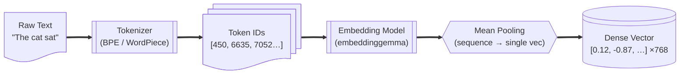
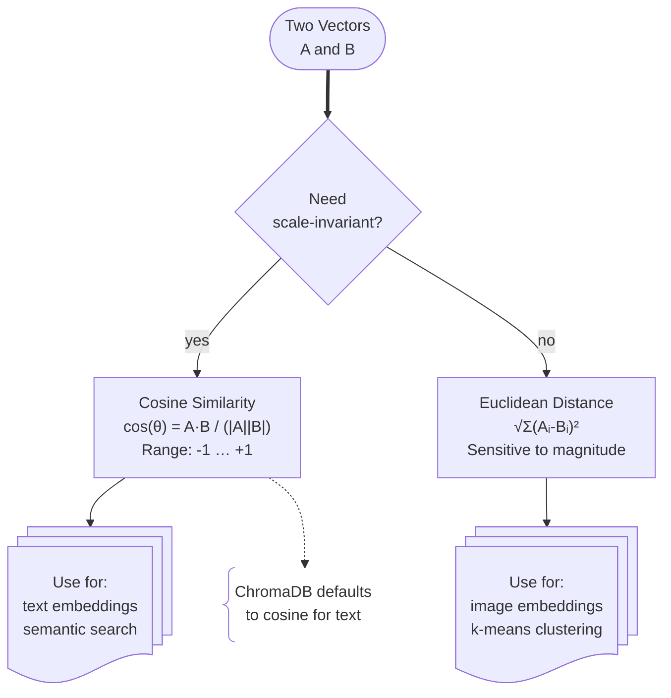
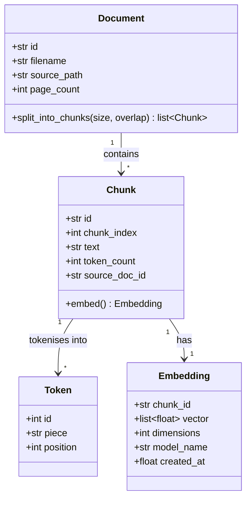

# Tokens and Embeddings

Every large language model works entirely with numbers. **Tokens** are the units a model reads; **embeddings** are the dense vectors that capture their meaning. Understanding both is essential for tuning chunk sizes, picking embedding models, and diagnosing retrieval problems.

---

## From Text to Vector



### Tokenisation

A **tokenizer** splits raw text into sub-word pieces and maps each piece to an integer ID from a fixed vocabulary.

```python
# Example using the HuggingFace tokenizer for embeddinggemma (offline, no API)
from transformers import AutoTokenizer

tokenizer = AutoTokenizer.from_pretrained("google/embeddinggemma-300m")
tokens = tokenizer("The cat sat on the mat")
print(tokens["input_ids"])  # [101, 1996, 4937, 2938, …, 102]
print(len(tokens["input_ids"]))  # number of tokens (not words)
```

Key point: **one word ≠ one token**. "embeddings" might tokenize as `["embed", "##dings"]` — two tokens. This matters when setting chunk sizes: always measure in tokens, not characters.

### Embedding

An **embedding model** takes a sequence of token IDs and produces a single fixed-length vector. For `embeddinggemma` the vector has 768 dimensions. Semantically similar texts produce vectors that are geometrically close.

```python
import ollama

response = ollama.embeddings(
    model="embeddinggemma",
    prompt="The cat sat on the mat",
)
vector: list[float] = response["embedding"]  # length 768
```

---

## Vector Space Similarity



**ChromaDB uses cosine similarity by default** when you create a collection with `embeddinggemma` embeddings. You can override with `metadata={"hnsw:space": "l2"}` but cosine is the right choice for text.

---

## Object Relationships



---

## Practical Implications for RAG

| Concept | Implication |
|---------|-------------|
| **Token count ≠ word count** | Set chunk size in tokens, not characters. Rule of thumb: 1 token ≈ 4 English characters. |
| **Embedding model dimension** | `embeddinggemma` = 768-d. Changing the model later requires re-embedding everything. |
| **Context window limit** | `embeddinggemma` supports up to 2 048-tokens per chunk. Don't exceed this. |
| **Cosine similarity range** | 1.0 = identical, 0.0 = orthogonal, -1.0 = opposite. Scores > 0.75 are usually relevant. |
| **Pooling matters** | Most embedding models use mean-pooling over the last hidden layer. Avoid models with only CLS-token pooling for long chunks. |

---

## Counting Tokens Before Chunking

```python
from transformers import AutoTokenizer

tokenizer = AutoTokenizer.from_pretrained("google/embeddinggemma-300m")

def count_tokens(text: str) -> int:
    return len(tokenizer.encode(text, add_special_tokens=False))

def fits_in_model(text: str, max_tokens: int = 2048) -> bool:
    return count_tokens(text) <= max_tokens
```

---

## Next Steps

- [Chunking Strategies →](chunking-strategies.md) — how to split documents into good chunks  
- [Prompting & Temperature →](prompting-and-temperature.md) — controlling generation  
- [ChromaDB →](../02-ecosystem/chromadb.md) — storing and querying embeddings
