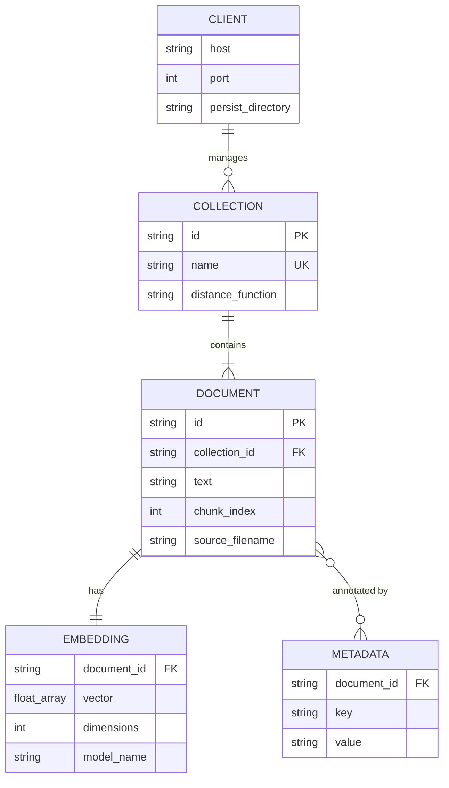
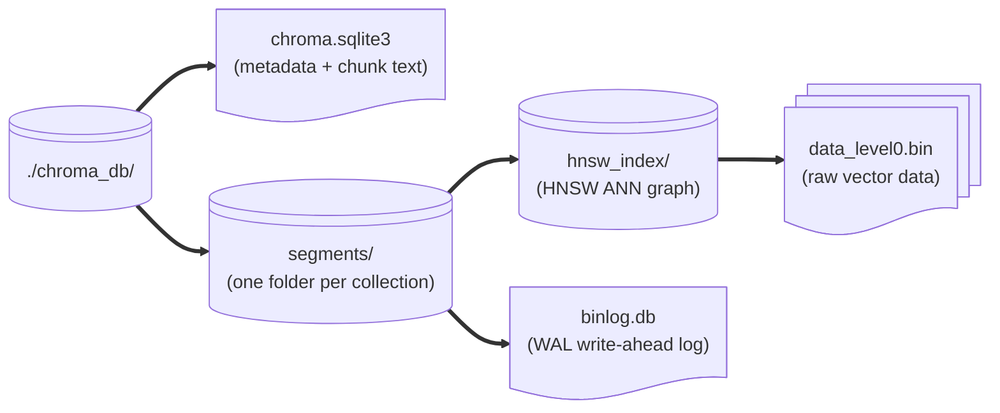

# ChromaDB

ChromaDB is an open-source, embedded vector database written in Python. It stores your text chunks alongside their embedding vectors, persists everything to a local folder, and provides fast approximate-nearest-neighbour (ANN) search so your RAG app can retrieve the most relevant chunks in milliseconds.

---

## Logical Data Model



---

## Where Files Live on Disk



> **Backup tip:** To back up your entire ChromaDB, copy the `./chroma_db/` folder. To restore, point a new `PersistentClient` at the copied folder.

---

## Python API Quick Reference

### Creating a persistent client

```python
import chromadb

client = chromadb.PersistentClient(path="./chroma_db")
```

The `PersistentClient` writes every mutation to disk immediately — no explicit `client.persist()` call is needed (unlike older Chroma versions).

### Collections

```python
# Get-or-create a collection
collection = client.get_or_create_collection(
    name="my_docs",
    metadata={"hnsw:space": "cosine"},  # cosine is default for text
)

# List all collections
for col in client.list_collections():
    print(col.name, col.count())

# Delete a collection
client.delete_collection("my_docs")
```

### Adding documents

```python
collection.add(
    ids=["chunk_001", "chunk_002"],
    embeddings=[[0.12, -0.87, ...], [0.55, 0.23, ...]],
    documents=["First chunk text...", "Second chunk text..."],
    metadatas=[
        {"source": "report.pdf", "page": 1, "chunk_index": 0},
        {"source": "report.pdf", "page": 1, "chunk_index": 1},
    ],
)
```

### Querying

```python
results = collection.query(
    query_embeddings=[[0.11, -0.85, ...]],  # embedded user query
    n_results=5,
    include=["documents", "metadatas", "distances"],
)

for doc, meta, dist in zip(
    results["documents"][0],
    results["metadatas"][0],
    results["distances"][0],
):
    print(f"[{dist:.3f}] {meta['source']} — {doc[:80]}")
```

### Metadata filters

```python
# Only retrieve chunks from a specific file
results = collection.query(
    query_embeddings=[query_vector],
    n_results=5,
    where={"source": "report.pdf"},
)

# Multiple conditions
results = collection.query(
    query_embeddings=[query_vector],
    n_results=5,
    where={"$and": [{"source": "report.pdf"}, {"page": {"$gte": 3}}]},
)
```

---

## HNSW Configuration

ChromaDB uses **Hierarchical Navigable Small World (HNSW)** graphs for ANN search. For most RAG workloads the defaults are fine, but you can tune at collection creation time:

| Parameter | Default | Effect |
|-----------|---------|--------|
| `hnsw:space` | `l2` | Distance metric: `l2`, `cosine`, `ip` |
| `hnsw:construction_ef` | `100` | Build quality — higher = slower build, better recall |
| `hnsw:search_ef` | `10` | Query quality — higher = slower query, better recall |
| `hnsw:M` | `16` | Graph connectivity — higher = more memory, better recall |

```python
collection = client.get_or_create_collection(
    name="my_docs",
    metadata={
        "hnsw:space": "cosine",
        "hnsw:construction_ef": 200,
        "hnsw:search_ef": 50,
    },
)
```

---

## Viewing ChromaDB Contents in the Streamlit UI

The **Browse ChromaDB** tab in the Streamlit app calls:

```python
def list_collection_contents(collection_name: str) -> list[dict]:
    collection = client.get_collection(collection_name)
    result = collection.get(include=["documents", "metadatas"])
    return [
        {"id": id_, "text": doc[:120], "meta": meta}
        for id_, doc, meta in zip(
            result["ids"], result["documents"], result["metadatas"]
        )
    ]
```

This shows you the raw chunk text and metadata stored in the database, letting you verify that ingestion succeeded.

---

## Next Steps

- [Ingestion Pipeline →](../04-build-the-app/02-ingestion-pipeline.md) — writing chunks into ChromaDB  
- [Retrieval & Generation →](../04-build-the-app/03-retrieval-and-generation.md) — querying ChromaDB  
- [Tokens & Embeddings →](../01-foundations/tokens-and-embeddings.md) — the vectors that go in the DB
