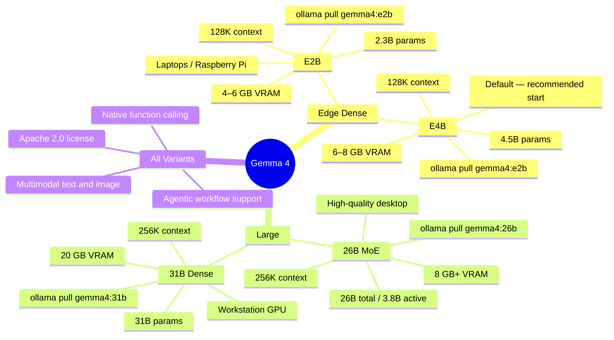
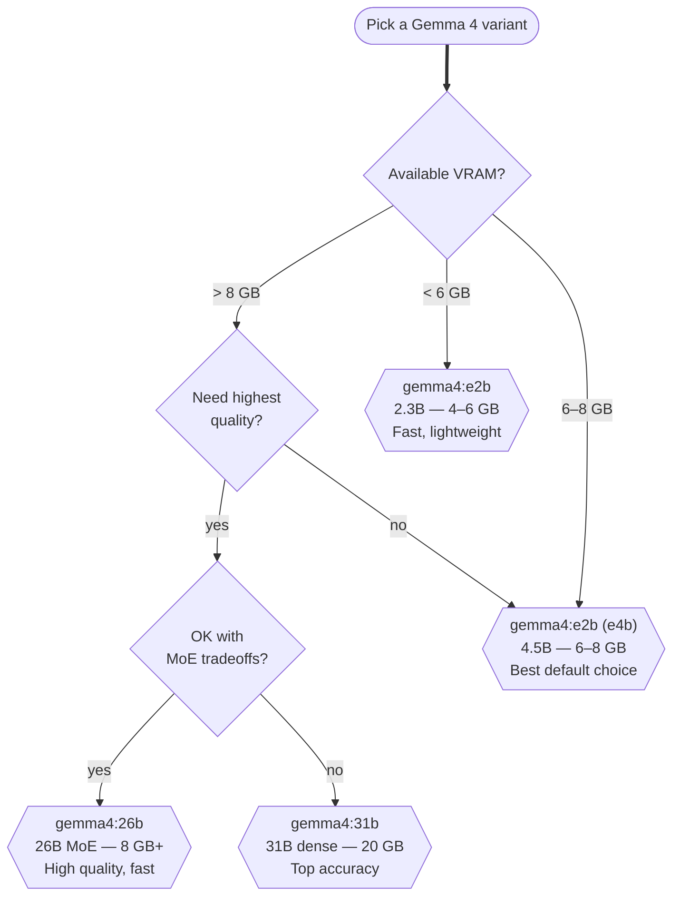
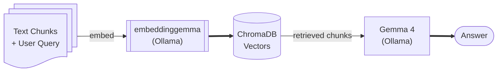

# Gemma 4 Models

Gemma 4 is Google DeepMind's fourth-generation open-weight model family, released in April 2026 under the **Apache 2.0 license**. It is multimodal (text + image), supports massive context windows, and runs locally via Ollama with a single pull command.

---

## The Gemma 4 Family

<!-- Diagram: Gemma 4 model family overview — four main sizes across two architecture types (edge dense models and larger MoE or full-dense models). `mindmap` does not support `accTitle`/`accDescr`; alt-text lives in the surrounding heading + this comment. -->



---

## Choosing the Right Gemma 4 Variant



---

## Embedding Model — embeddinggemma

Gemma 4 is an **instruction-following generative model**, not an embedding model. For RAG you need a separate model purpose-built for embeddings:

| Model | Dimensions | Max tokens | Size | Command |
|-------|-----------|------------|------|---------|
| **embeddinggemma** *(used in this app)* | 768 | 2 048 | 622 MB | `ollama pull embeddinggemma` |
| **nomic-embed-text** *(alternative)* | 768 | 8 192 | 274 MB | `ollama pull nomic-embed-text` |
| **mxbai-embed-large** *(alternative)* | 1 024 | 512 | 669 MB | `ollama pull mxbai-embed-large` |
| **snowflake-arctic-embed** | 1 024 | 512 | 669 MB | `ollama pull snowflake-arctic-embed` |



> Use `embeddinggemma` for all embedding calls — it is fast, lightweight (622 MB), and purpose-built for retrieval. Pull it once and it stays cached.

---

## Quantization

Ollama ships GGUF files which are already quantized. The default tag uses **Q4_K_M** quantization — a good balance of quality and memory:

| Quantization | VRAM reduction | Quality loss | Notes |
|---|---|---|---|
| Q8_0 | ~50 % vs FP16 | Minimal | Highest local quality |
| **Q4_K_M** | ~75 % vs FP16 | Small | Default; recommended |
| Q4_0 | ~75 % vs FP16 | Small | Slightly faster than K_M |
| Q2_K | ~87 % vs FP16 | Noticeable | Only if VRAM is very tight |

You cannot change quantization after pulling — pull a different tag if needed (e.g., `gemma4:e4b-q8_0` if that tag is published by the community).

---

## Gemma 4 Key Capabilities

- **Multimodal** — can accept both text and images as input (image upload in Streamlit is possible)
- **Function calling** — native structured output for agentic pipelines
- **Long context** — 128K tokens (E2B/E4B) or 256K tokens (26B/31B)
- **Apache 2.0** — fully open; commercial use, fine-tuning, and redistribution are all allowed
- **Agentic** — designed for tool use and multi-step reasoning

---

## Pulling and Verifying

```bash
# Pull the recommended default
ollama pull gemma4:e2b

# Verify it loaded correctly
ollama run gemma4:e2b "What is RAG? Answer in one sentence."

# Pull the embedding model
ollama pull embeddinggemma
```

Expected VRAM after loading both models simultaneously: ~6–8 GB (GPU) or ~8–12 GB RAM (CPU only).

---

## Next Steps

- [ChromaDB →](chromadb.md) — the vector store  
- [Prompting & Temperature →](../01-foundations/prompting-and-temperature.md) — tuning Gemma 4's output  
- [Dependencies →](../03-python-setup/dependencies.md) — Python packages needed
