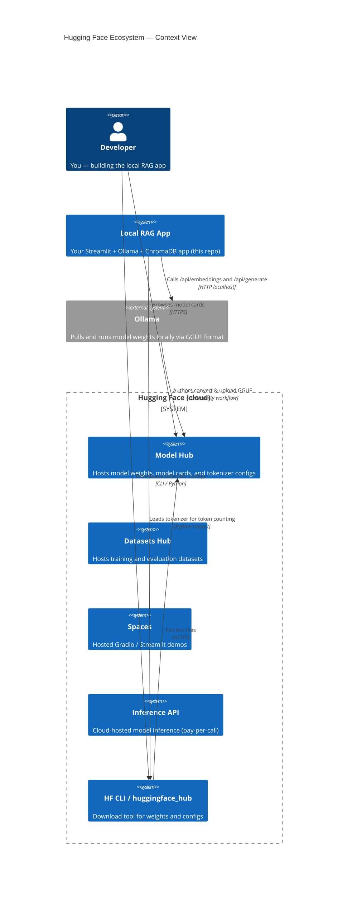

# Hugging Face

Hugging Face (HF) is the central hub for open-source AI — model weights, datasets, training code, and demo apps all live there. For a **fully local RAG app** you use HF primarily to **discover models and read their cards**, then pull the actual weights via Ollama rather than the HF Inference API.

---

## The HF Ecosystem



> The local RAG app **never calls** the HF Inference API. All inference runs through Ollama on your machine.

---

## Key HF Concepts

### Model Hub

The Model Hub at [huggingface.co/models](https://huggingface.co/models) hosts hundreds of thousands of model checkpoints. Each model has a **model card** — a README describing:

- Architecture and parameter count
- Training data and methodology
- Intended use and limitations
- License terms
- Evaluation benchmarks

Always read the model card before using a model in production.

### Licenses

| License | Commercial use | Modification | Distribution |
|---------|---------------|--------------|--------------|
| **Apache 2.0** | ✅ | ✅ | ✅ (with attribution) |
| **MIT** | ✅ | ✅ | ✅ |
| **Llama Community License** | Conditional | ✅ | Conditional |
| **Gemma Terms of Use** (old) | Conditional | ✅ | Conditional |
| **Gemma 4 — Apache 2.0** | ✅ | ✅ | ✅ |

Gemma 4 is licensed under **Apache 2.0** — you can use it commercially, modify it, and redistribute it.

### Gated Models

Some models (e.g., older Llama versions) require you to accept a license on the HF website before downloading. `embeddinggemma` and Gemma 4 (via Ollama) are **not gated**.

---

## HF CLI — Downloading Tokenizer Configs

You need the tokenizer config locally to count tokens accurately before chunking ([→ Tokens & Embeddings](../01-foundations/tokens-and-embeddings.md)).

```bash
# Add to the project (run from Local-RAG/)
uv add huggingface_hub

# Login (only needed for gated models) — invoke through uv
uv run huggingface-cli login
```

```bash
# Login (only needed for gated models)
huggingface-cli login

# Download just the tokenizer files (not the full 5 GB weights)
huggingface-cli download google/embeddinggemma-300m \
    --include "tokenizer*" "config.json" \
    --local-dir ./models/embeddinggemma
```

```python
from transformers import AutoTokenizer

# Load from local cache — no network call
tokenizer = AutoTokenizer.from_pretrained(
    "./models/embeddinggemma",
    local_files_only=True,
)
```

---

## What You DON'T Need from HF

| HF Feature | Used in this app? | Why not |
|---|---|---|
| `pipeline()` | ❌ | Ollama handles inference |
| Inference API | ❌ | All local via Ollama |
| `AutoModel.from_pretrained` weights | ❌ | Ollama loads GGUF weights |
| Datasets Hub | ❌ | You supply your own docs |
| Spaces | ❌ | Streamlit runs locally |
| Tokenizer configs | ✅ | For accurate token counting |

---

## Further Reference

- [huggingface.co/models](https://huggingface.co/models) — browse all models
- [huggingface.co/google/embeddinggemma-300m](https://huggingface.co/google/embeddinggemma-300m) — embedding model card
- [huggingface.co/google/gemma-4](https://huggingface.co/google/gemma-4) — Gemma 4 model card
- [HF CLI docs](https://huggingface.co/docs/huggingface_hub/guides/cli) — full CLI reference

---

## Next Steps

- [Ollama →](ollama.md) — pulling and running models locally  
- [Gemma 4 Models →](gemma-models.md) — the inference model for this app
