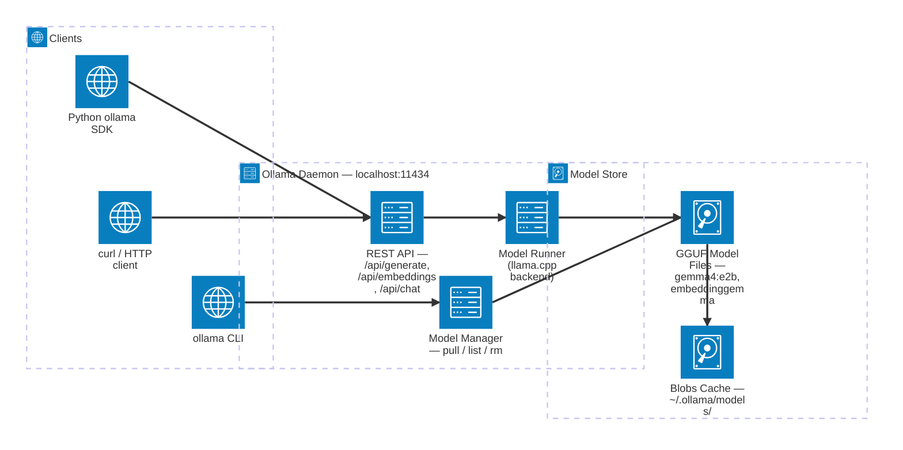
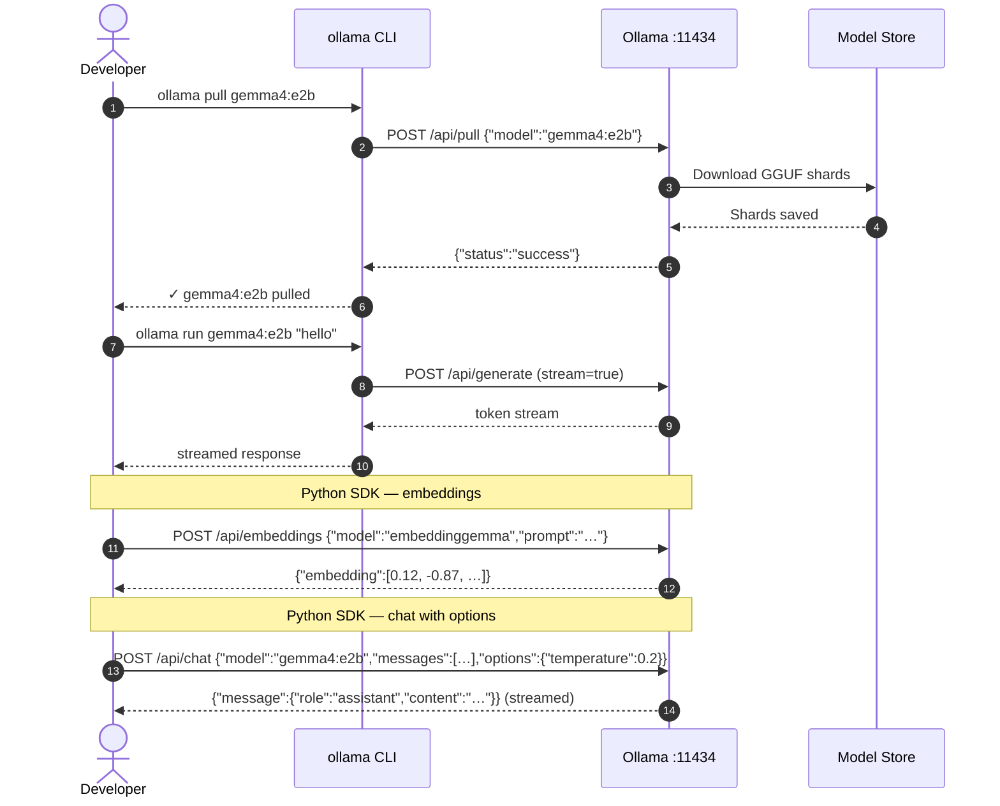

# Ollama

Ollama is a single binary that downloads, manages, and serves open-weight language models on your laptop or server. It exposes a local REST API on port `11434` so any Python script — including your RAG app — can call models without writing GPU/CUDA code.

---

## Ollama Service Topology



---

## Installation

### macOS
```bash
brew install ollama
# or download the .app from https://ollama.com/download
ollama serve   # starts the daemon (the .app auto-starts it)
```

### Linux
```bash
curl -fsSL https://ollama.com/install.sh | sh
# Systemd service is registered automatically
sudo systemctl enable --now ollama
```

### Windows
Download the installer from [ollama.com/download](https://ollama.com/download). The installer adds Ollama to the system tray and starts the daemon automatically.

> **WSL 2 note:** Install the Windows native Ollama binary (not inside WSL). Call it from WSL via `http://host.docker.internal:11434` or expose it with `OLLAMA_HOST=0.0.0.0` in Windows.

### GPU support
Ollama auto-detects NVIDIA and AMD GPUs. Install the relevant drivers first:
- NVIDIA: [CUDA Toolkit ≥ 12](https://developer.nvidia.com/cuda-downloads)
- AMD: [ROCm ≥ 6](https://rocm.docs.amd.com/en/latest/deploy/linux/quick_start.html)
- Apple Silicon: included in macOS Metal drivers — no extra install needed.

---

## Common Commands

```bash
ollama pull gemma4:e2b               # download the default gemma4:e4b variant (~5 GB)
ollama pull gemma4:e2b           # lightweight — 4–6 GB VRAM
ollama pull embeddinggemma     # embedding model — ~622 MB

ollama list                      # show downloaded models
ollama ps                        # show currently loaded models (in VRAM)
ollama run gemma4:e2b                # interactive chat session
ollama rm gemma4:e2b             # delete a model

ollama show gemma4:e2b               # model card info (architecture, size, context)
```

---

## REST API Walkthrough



---

## Python SDK

```powershell
# Add it to the project (already declared in pyproject.toml for Local-RAG)
uv add ollama
```

```python
import ollama

# --- Embeddings ---
resp = ollama.embeddings(model="embeddinggemma", prompt="The cat sat on the mat")
vector: list[float] = resp["embedding"]

# --- Chat (streaming) ---
stream = ollama.chat(
    model="gemma4:e2b",
    messages=[{"role": "user", "content": "Explain RAG in one sentence."}],
    options={"temperature": 0.2},
    stream=True,
)
for chunk in stream:
    print(chunk["message"]["content"], end="", flush=True)

# --- List local models ---
models = ollama.list()
for m in models["models"]:
    print(m["name"], m["size"])
```

---

## Environment Variables

| Variable | Default | Description |
|----------|---------|-------------|
| `OLLAMA_HOST` | `127.0.0.1:11434` | Bind address for the API |
| `OLLAMA_MODELS` | `~/.ollama/models` | Model storage directory |
| `OLLAMA_NUM_PARALLEL` | `1` | Concurrent requests |
| `OLLAMA_MAX_LOADED_MODELS` | `1` | Models kept in VRAM |
| `OLLAMA_GPU_OVERHEAD` | `0` | VRAM bytes reserved for OS |

---

## Next Steps

- [Gemma 4 Models →](gemma-models.md) — model sizes and which to pick  
- [embeddinggemma →](gemma-models.md#embedding-model-embeddinggemma) — embedding model details  
- [Ingestion Pipeline →](../04-build-the-app/02-ingestion-pipeline.md) — calling Ollama from the app
