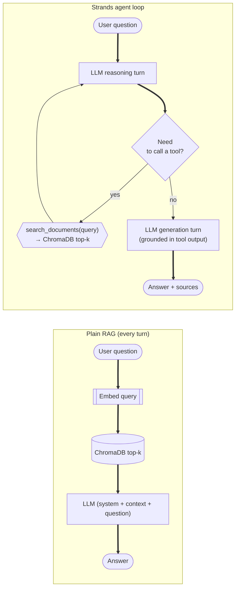
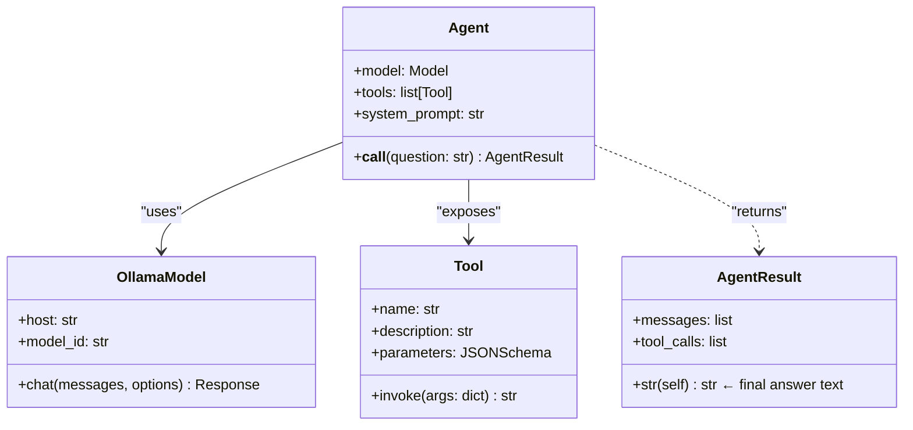
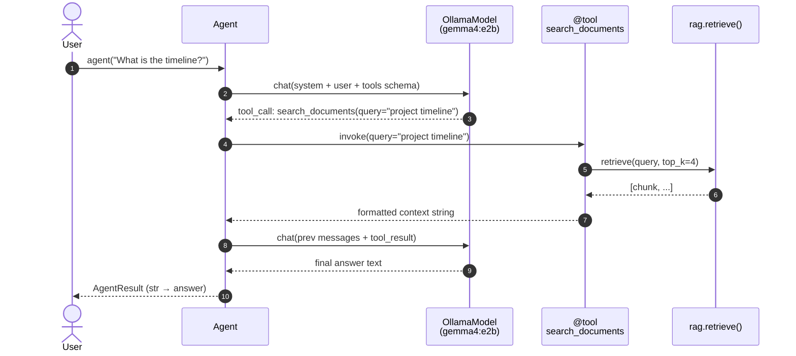
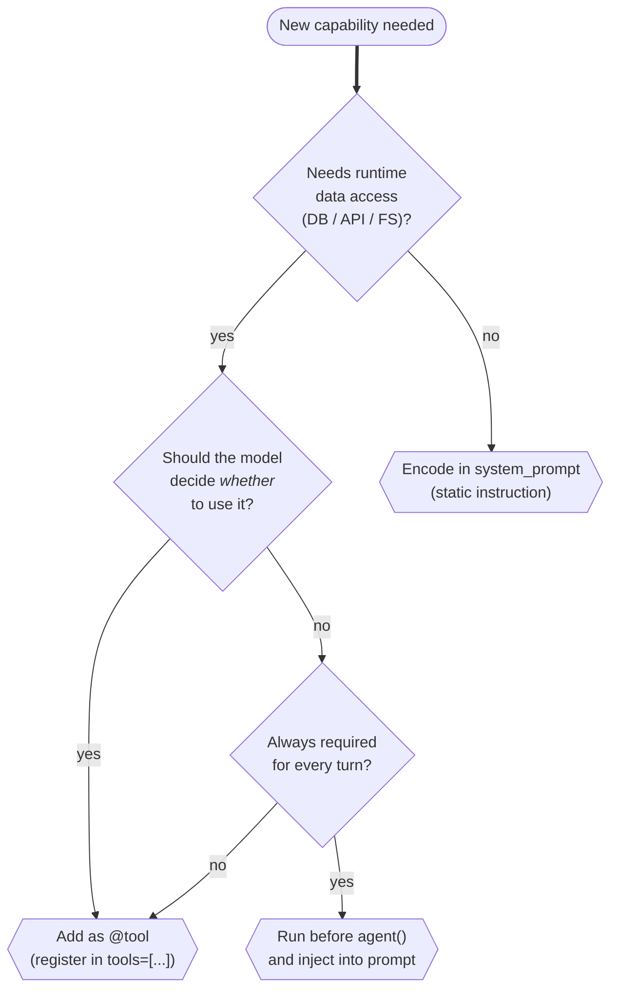

# Strands Agents

[Strands Agents](https://strandsagents.com) is a small, model-agnostic Python framework for building **agents** — LLM-driven loops that can call tools, observe the results, and reason about what to do next. The Local-RAG app uses Strands to wrap Gemma 4 inside a `search_documents`-aware agent so the model decides *when* to retrieve, instead of having retrieval bolted on every turn.

---

## Why an agent instead of plain chat?



The agent keeps the same control flow as a chat loop but lets the LLM **call tools as needed** — including not at all, or more than once for a multi-hop question.

---

## Anatomy of a Strands Agent



The four building blocks the Local-RAG app uses:

| Concept | Where it lives | Purpose |
|---|---|---|
| `Agent` | `strands.Agent` | The reasoning loop — orchestrates LLM turns and tool calls. |
| `OllamaModel` | `strands.models.ollama.OllamaModel` | Adapts the local Ollama daemon (`http://localhost:11434`) to Strands' model interface. |
| `@tool` | `strands.tool` | Decorator that turns a regular Python function into a tool the LLM can invoke. The function's docstring + type hints become the tool's schema. |
| System prompt | string passed to `Agent(system_prompt=...)` | Tells the LLM how to behave (always call `search_documents` first, cite sources, etc.). |

---

## How the LLM decides to call a tool

Strands forwards the tool list to the underlying model as a **function-calling schema**. Gemma 4 has native function-calling — when its sampled output contains a tool call, Strands intercepts it, runs the Python function, appends the result as a tool message, and asks the model to continue.



---

## The `@tool` decorator

Strands inspects the function signature and docstring to build a JSON schema the LLM can target. Keep docstrings **action-oriented and unambiguous** — the LLM uses them to decide *whether* to call the tool.

```python
from strands import tool

@tool
def search_documents(query: str) -> str:
    """Search the indexed proposal documents for relevant information.

    Use this tool whenever a question is asked about the engineering proposals.
    Retrieves the most semantically similar passages from the local vector store.

    Args:
        query: The search query used to find relevant document passages.

    Returns:
        Formatted document passages with source file names and chunk indices,
        ready to use as context for answering the question.
    """
    chunks = rag.retrieve(query, top_k=4)
    return "\n\n".join(
        f"[{i}] Source: {c['source']} | Chunk #{c['chunk_index']}\n{c['doc']}"
        for i, c in enumerate(chunks, start=1)
    )
```

> **Heuristic.** A vague docstring (`"Use this when needed."`) leads to under-calling or random calling. Be specific about *when* to call it and *what* it returns.

---

## Wiring an Agent to local Ollama

```python
from strands import Agent
from strands.models.ollama import OllamaModel

model = OllamaModel(
    host="http://localhost:11434",
    model_id="gemma4:e2b",
    # Optional generation overrides (Strands forwards to Ollama as `options`)
    # temperature=0.2, top_p=0.9, top_k=40,
)

SYSTEM_PROMPT = (
    "You are a helpful assistant that answers questions about engineering proposals. "
    "Always call the search_documents tool first to retrieve relevant context before answering. "
    "Answer ONLY using the information returned by the tool. "
    "If the tool returns no relevant content, say 'I could not find that in the provided documents.' "
    "Cite your sources using the format [source_filename.pdf #chunk_index] after each factual statement."
)

agent = Agent(
    model=model,
    tools=[search_documents],
    system_prompt=SYSTEM_PROMPT,
)

result = agent("Summarise the cost section.")
print(str(result))   # final answer text
```

**Key behaviours of the Local-RAG agent:**

- **Persistent across turns.** The Streamlit app stashes the `Agent` in `st.session_state["strands_agent"]` so its internal message history survives Streamlit reruns. Clearing the chat creates a new agent.
- **Non-streaming.** The shipped app uses `agent(question)` and renders the full `str(response)` once it returns. *(Token streaming is a planned enhancement — the underlying `OllamaModel` supports it, but the Strands `Agent.__call__` API used here does not surface tokens.)*
- **Single tool.** Only `search_documents` is registered. Adding more tools (e.g. `list_sources`, `count_chunks`) is a one-liner — pass them in the `tools=[...]` list.
- **Sources side-channel.** The tool writes to a module-level `_last_chunks` list so the UI can render a Sources expander after each answer. This is fine for a single-user local app; for concurrent use, scope it to the agent or session.

---

## When to add another tool



---

## Common pitfalls

| Symptom | Likely cause | Fix |
|---|---|---|
| Agent never calls the tool | Docstring too vague, or model has no function-calling support | Tighten the docstring's "Use this whenever…" sentence; verify the model variant supports tools (Gemma 4 does) |
| Agent calls the tool every turn even on small talk | System prompt mandates "always call" | Reword to "call when the question references the documents" |
| Tool gets called with garbled args | Type hints missing on the tool function | Always annotate parameter and return types |
| Long, drifting answers | No explicit grounding instruction | Add "Answer ONLY using the tool output" to the system prompt |
| Sources not appearing in UI | `_last_chunks` not updated by the tool | Make sure the tool writes to the shared list **before** returning |

---

## Where to read more

| Resource | URL |
|---|---|
| Strands Agents docs | https://strandsagents.com |
| Strands GitHub | https://github.com/strands-agents/sdk-python |
| `OllamaModel` reference | https://strandsagents.com/latest/user-guide/concepts/model-providers/ollama/ |
| Tools & `@tool` reference | https://strandsagents.com/latest/user-guide/concepts/tools/python-tools/ |

---

## Next Steps

- [Retrieval & Generation →](../04-build-the-app/03-retrieval-and-generation.md) — how the agent calls into `rag.py`
- [Ollama →](ollama.md) — the local model server behind `OllamaModel`
- [Gemma 4 Models →](gemma-models.md) — why `gemma4:e2b` is the default tag
