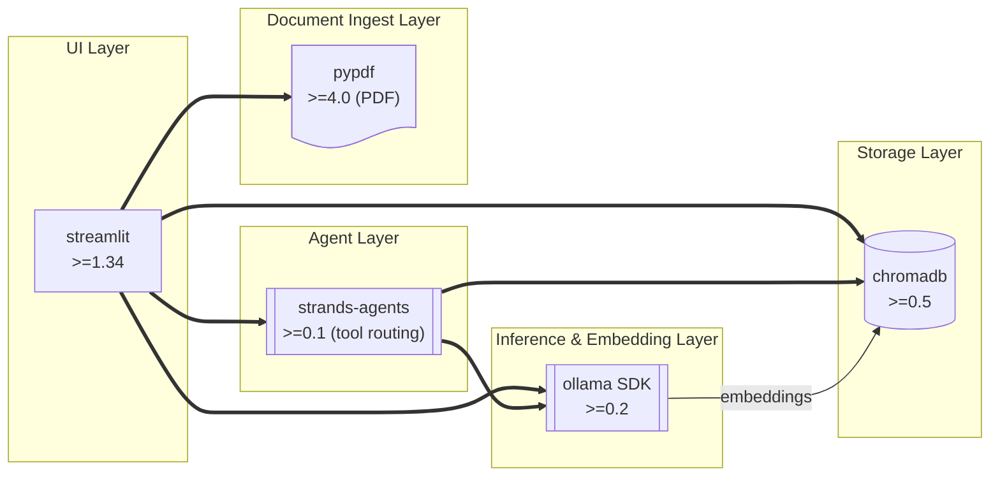

# Python Dependencies

The local RAG app declares its dependencies in **`pyproject.toml`** and pins exact versions in **`uv.lock`**. There is no `requirements.txt` and no `pip install` step — `uv sync` is the only command needed to materialise the environment.

---

## `pyproject.toml`

The project's dependency declaration as it actually ships in `Local-RAG/`:

```toml
[project]
name = "rag-app"
version = "0.2.0"
requires-python = ">=3.11"
dependencies = [
    "streamlit>=1.34.0",     # Local web UI
    "chromadb>=0.5.0",       # Embedded vector DB with HNSW index
    "ollama>=0.2.0",         # Ollama Python SDK — wraps the :11434 REST API
    "pypdf>=4.0.0",          # PDF text extraction
    "strands-agents>=0.1.0", # Agent / tool-calling framework used by agent.py
]
```

`uv sync` reads this file plus `uv.lock` and installs an exact, reproducible set of versions into `.venv/`.

---

## Adding, Removing, and Upgrading Packages

Never edit `pyproject.toml` by hand for dependency changes — let `uv` keep the lockfile consistent:

```powershell
# Add a runtime dependency
uv add rich

# Add a dev-only dependency
uv add --dev pytest

# Remove a dependency
uv remove rich

# Upgrade one package to its latest compatible version
uv lock --upgrade-package chromadb
uv sync

# Upgrade everything within the declared version constraints
uv lock --upgrade
uv sync
```

Each command updates both `pyproject.toml` and `uv.lock` atomically.

---

## Package Roles



---

## Why Each Package Is Pinned

| Package | Min version | Why pinned |
|---------|-------------|------------|
| `chromadb` | 0.5.0 | `PersistentClient` API stable; older versions need `.persist()` |
| `ollama` | 0.2.0 | `ollama.chat()` streaming and `options` dict support |
| `streamlit` | 1.34.0 | `st.chat_input` / `st.chat_message` stable API |
| `pypdf` | 4.0.0 | Replaces deprecated `PyPDF2`; current maintained fork |
| `strands-agents` | 0.1.0 | First public release of the `@tool` decorator API used in `agent.py` |

Exact resolved versions live in `uv.lock` — commit it to git so every environment is byte-identical.

---

## Optional Extras

If you add evaluation, telemetry, or multimodal support later, add them through `uv`:

```powershell
# Evaluation harness (see 05-operations/evaluating-rag.md)
uv add pandas rich

# Image support for multimodal Gemma 4 prompts
uv add pillow

# Alternative chunkers (only if you outgrow the simple chunker in ingest.py)
uv add langchain-text-splitters
```

---

## OS-Specific Notes

### Windows — ChromaDB native extensions

ChromaDB bundles `hnswlib`, which needs a C++ toolchain to build from source if no wheel is available:

```powershell
winget install Microsoft.VisualStudio.2022.BuildTools
uv sync
```

If a build still fails, force the pre-built wheel:

```powershell
uv pip install --only-binary=:all: chromadb
```

### macOS (Apple Silicon)

All packages ship native ARM64 wheels. If `uv sync` fails on `chromadb`:

```bash
brew install cmake
uv sync
```

### Linux

No extra steps — every dependency has a manylinux wheel. If `libstdc++` is too old:

```bash
sudo apt install libstdc++6
```

---

## Checking Everything Works

```powershell
uv run python -c "import chromadb, ollama, streamlit, pypdf, strands; \
print('chromadb   ', chromadb.__version__); \
print('ollama     ', ollama.__version__); \
print('streamlit  ', streamlit.__version__); \
print('pypdf      ', pypdf.__version__); \
print('strands    ', strands.__version__); \
print('All imports OK')"
```

---

## Next Steps

- [Project Layout →](../04-build-the-app/01-project-layout.md) — folder structure for the app
- [Ingestion Pipeline →](../04-build-the-app/02-ingestion-pipeline.md) — using these packages in code
