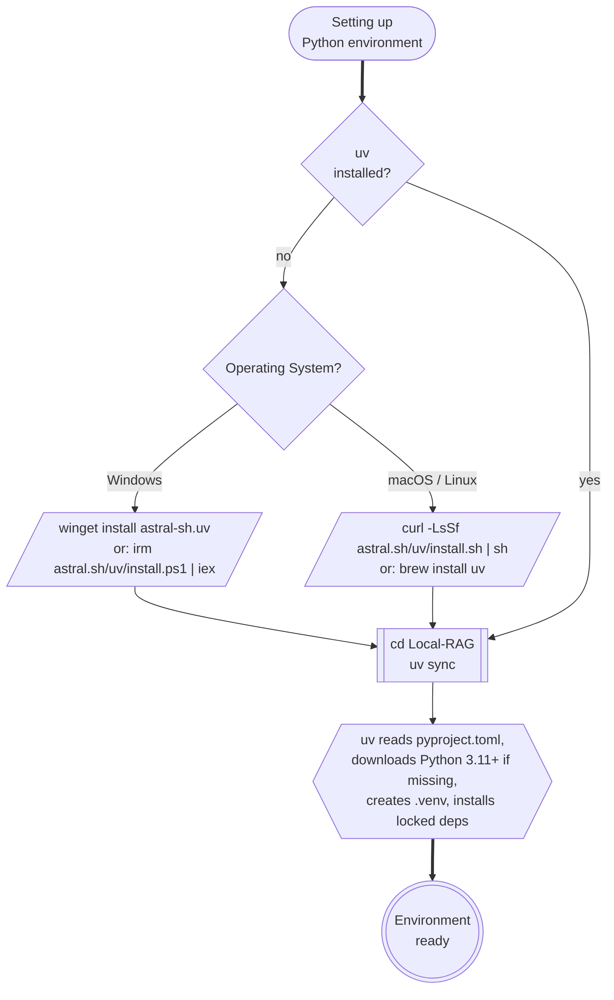

# Python Environment Setup

The RAG app requires **Python 3.11 or newer** and uses **[uv](https://docs.astral.sh/uv/)** as the sole package and environment manager. `uv` reads `pyproject.toml`, locks resolved versions in `uv.lock`, and creates the `.venv` folder for you — there is no `requirements.txt` and no manual `python -m venv` step.

---

## Setup Decision Tree



---

## Install `uv`

```powershell
# Windows (PowerShell)
winget install astral-sh.uv
# or:
powershell -c "irm https://astral.sh/uv/install.ps1 | iex"
```

```bash
# macOS / Linux
curl -LsSf https://astral.sh/uv/install.sh | sh
# or on macOS:
brew install uv
```

Verify:
```bash
uv --version
```

---

## Create the Project Environment

From the repository root (`Local-RAG/`):

```powershell
uv sync
```

That single command will:

1. Read `pyproject.toml` for declared dependencies and `uv.lock` for exact pinned versions.
2. Download a compatible Python interpreter (3.11+) if one is not already on the system — no separate Python install needed.
3. Create `.venv/` in the project directory.
4. Install every locked dependency into `.venv/`.

You do **not** need to activate the venv. Run the app through `uv run`:

```powershell
uv run streamlit run app.py
```

> Ingestion is invoked from the Streamlit sidebar (**Re-ingest PDFs**), not from the CLI. `ingest.py` only defines the pipeline functions — `uv run python ingest.py` will exit silently without creating `chroma_db/`.

If you prefer an activated shell (e.g. for `python` REPL or IDE integration):

```powershell
.venv\Scripts\activate              # Windows PowerShell
source .venv/bin/activate           # macOS / Linux
```

---

## Common `uv` Commands

| Task | Command |
|------|---------|
| Install / restore env from lockfile | `uv sync` |
| Add a new dependency | `uv add <package>` |
| Remove a dependency | `uv remove <package>` |
| Upgrade a dependency | `uv lock --upgrade-package <package>` then `uv sync` |
| Run a project script | `uv run python <script>.py` |
| Run an installed CLI tool | `uv run <tool> ...` (e.g. `uv run streamlit run app.py`) |
| List installed packages | `uv pip list` |
| Show the resolved Python | `uv run python --version` |

---

## Python Version Check

```powershell
uv run python --version    # should print 3.11.x or newer
```

`requires-python = ">=3.11"` is declared in `pyproject.toml`, so `uv` will refuse to use an older interpreter.

---

## OS-Specific Notes

### Windows

- Use **PowerShell**, not Command Prompt.
- If you see `Execution policy` errors: `Set-ExecutionPolicy RemoteSigned -Scope CurrentUser`
- ChromaDB on Windows requires **Microsoft C++ Build Tools** for some native extensions:
  ```powershell
  winget install Microsoft.VisualStudio.2022.BuildTools
  ```

### macOS (Apple Silicon)

- ChromaDB and `hnswlib` compile for ARM64 natively — no Rosetta needed.
- If `uv sync` fails on `chromadb`, try: `brew install cmake` first, then re-run `uv sync`.

### Linux

- `uv` will download a managed Python interpreter even if the system Python is too old — no `apt` install required.
- If you would rather use the system Python, install 3.11+ explicitly:
  ```bash
  sudo add-apt-repository ppa:deadsnakes/ppa
  sudo apt install python3.12 python3.12-dev
  ```

---

## Next Steps

- [Dependencies →](dependencies.md) — exact package versions  
- [Project Layout →](../04-build-the-app/01-project-layout.md) — where to put the `.venv` folder
