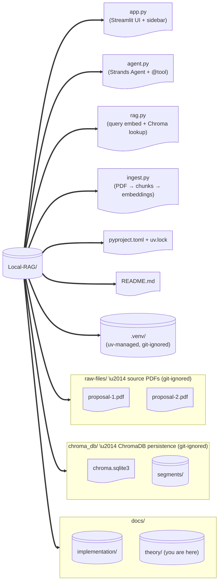
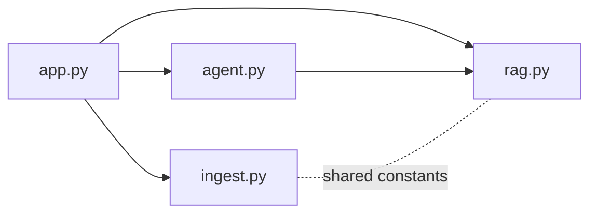

# Project Layout

The shipped Local-RAG app uses a **flat layout** — four small Python modules at the project root, with no `src/` package. The diagram below matches what you will see if you `git clone` the repo.

---

## Layout (matches the shipped code)



> **Why flat instead of `src/` package?** The app is small (\u2248 4 files, < 400 lines total). A package layer would add import boilerplate without paying for itself. If the project grows past ~10 modules, promote to `src/local_rag/` and update `pyproject.toml` accordingly.

---

## Module Responsibilities

| File | Responsibility | Key public surface |
|---|---|---|
| `app.py` | Streamlit UI: sidebar status, **Re-ingest PDFs** button, chat input, sources expander. Owns `st.session_state["strands_agent"]`. | `get_chunk_count()` |
| `agent.py` | Strands `Agent` factory + `search_documents` `@tool`. Holds module-level `_last_chunks` so the UI can render citations. | `create_agent()`, `search_documents`, `GEN_MODEL`, `OLLAMA_HOST` |
| `rag.py` | Query-time embedding (with EmbeddingGemma's `task: question answering | query:` prefix) and Chroma `collection.query()`. | `embed_query()`, `get_collection()`, `retrieve(question, top_k)` |
| `ingest.py` | One-shot pipeline: scan `raw-files/`, extract PDF text, chunk with a sliding window, embed each chunk (`title: none | text:` prefix), wipe + rewrite the Chroma collection. | `read_pdf_text()`, `chunk_text()`, `embed_batch()`, `ingest(progress_cb)` |



---

## File-by-File Reference

### `app.py`

Streamlit entry point. Reads `rag.get_collection().count()` for the sidebar, exposes the **Re-ingest PDFs** button, persists a Strands `Agent` across reruns, and renders the chat history + Sources expander.

### `agent.py`

```python
# agent.py (sketch)
from strands import Agent, tool
from strands.models.ollama import OllamaModel
import rag

GEN_MODEL = "gemma4:31b"   # active default; use "gemma4:e2b" for a laptop fallback
OLLAMA_HOST = "http://localhost:11434"
_last_chunks: list[dict] = []

@tool
def search_documents(query: str) -> str:
    """Search the indexed proposal documents for relevant information."""
    global _last_chunks
    chunks = rag.retrieve(query, top_k=4)
    _last_chunks = chunks
    return "\n\n".join(
        f"[{i}] Source: {c['source']} | Chunk #{c['chunk_index']}\n{c['doc']}"
        for i, c in enumerate(chunks, start=1)
    )

def create_agent() -> Agent:
    return Agent(
        model=OllamaModel(host=OLLAMA_HOST, model_id=GEN_MODEL),
        tools=[search_documents],
        system_prompt="You are a helpful assistant ...",
    )
```

### `rag.py`

Query-time retrieval only — generation happens inside the Strands agent's LLM turn, **not** here.

```python
# rag.py (sketch)
import ollama, chromadb
from pathlib import Path

DB_DIR = Path(__file__).parent / "chroma_db"
COLLECTION = "proposals_gemma"
EMBED_MODEL = "embeddinggemma"

def embed_query(question: str) -> list[float]:
    prompt = f"task: question answering | query: {question}"
    return ollama.embeddings(model=EMBED_MODEL, prompt=prompt)["embedding"]

def get_collection():
    return chromadb.PersistentClient(path=str(DB_DIR)).get_collection(COLLECTION)

def retrieve(question: str, top_k: int = 4) -> list[dict]:
    res = get_collection().query(
        query_embeddings=[embed_query(question)],
        n_results=top_k,
        include=["documents", "metadatas", "distances"],
    )
    return [
        {"doc": d, "source": m.get("source", "unknown"),
         "chunk_index": m.get("chunk_index", 0), "distance": dist}
        for d, m, dist in zip(res["documents"][0], res["metadatas"][0], res["distances"][0])
    ]
```

### `ingest.py`

Reads every `*.pdf` under `raw-files/`, chunks each with a 1 200-char / 200-overlap sliding window, embeds with the `title: none | text: {chunk}` prefix, and writes everything to a fresh `proposals_gemma` Chroma collection.

> **Planned but not yet implemented:**
> - **`config.py` + `.env`** to centralise model names, paths, chunk sizes, top-k. Today these are module-level constants in `agent.py`, `rag.py`, and `ingest.py`.
> - **`db.py`** Chroma client singleton (`PersistentClient` is currently re-instantiated each call \u2014 cheap, but a singleton would be cleaner).
> - **`models/` tokenizer cache** for accurate token counting in chunking. See [Chunking Strategies](../01-foundations/chunking-strategies.md).
> - **`uploads/`** directory + Streamlit file uploader for non-PDF formats (MD / TXT / DOCX). See [Ingestion Pipeline](02-ingestion-pipeline.md).

---

## `.gitignore` Essentials

```gitignore
.venv/
chroma_db/
raw-files/
__pycache__/
*.pyc
.env
```

> Never commit `chroma_db/` or `raw-files/` \u2014 they contain your private documents.

---

## Creating the Structure

```powershell
mkdir Local-RAG
cd Local-RAG
uv init                  # creates pyproject.toml + .python-version
mkdir raw-files, chroma_db
New-Item app.py, agent.py, rag.py, ingest.py -ItemType File
```

> **uv replaces `requirements.txt`.** Dependencies are declared in `pyproject.toml` and pinned in `uv.lock`. Add packages with `uv add <pkg>` and materialise the env with `uv sync` — never `pip install`.

---

## Next Steps

- [Ingestion Pipeline →](02-ingestion-pipeline.md) — implementing `ingest.py`
- [Retrieval & Generation →](03-retrieval-and-generation.md) — implementing `rag.py` + `agent.py`
- [Strands Agents →](../02-ecosystem/strands-agents.md) — the agent loop powering `agent.py`
- [Streamlit UI →](04-streamlit-ui.md) — building `app.py`
