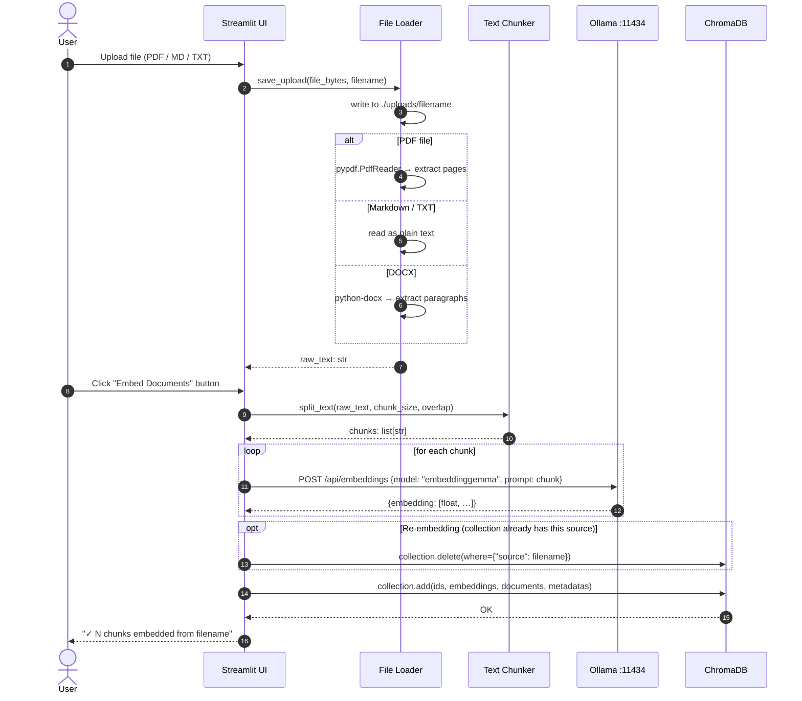
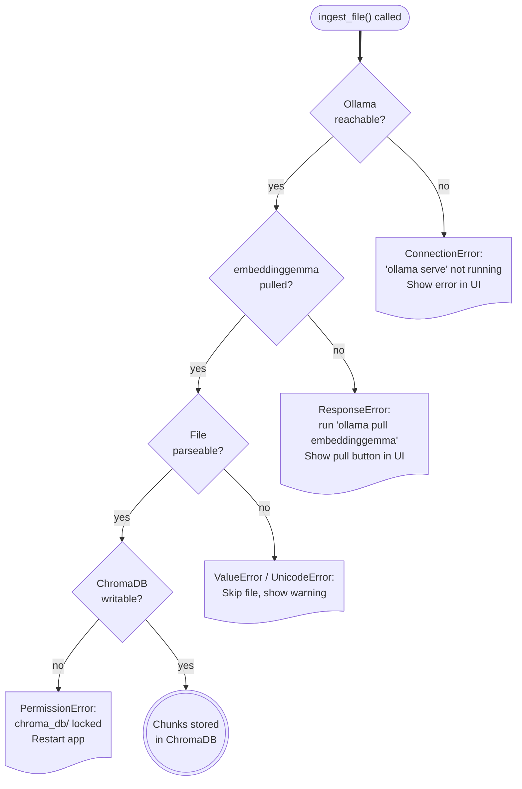

# Ingestion Pipeline

> **⚠ Multi-format ingestion — partially planned.**
> The shipped `ingest.py` accepts **PDFs only**, read directly from `raw-files/` on disk (no UI uploader). The MD / TXT / DOCX support and the Streamlit file uploader described below are a planned enhancement; the rest of the pipeline (chunk → embed with `title: none | text:` prefix → store in `proposals_gemma`) matches reality.

The ingestion pipeline takes a raw document uploaded through the Streamlit UI, splits it into chunks, embeds each chunk with `embeddinggemma` via Ollama, and stores the vectors and metadata in ChromaDB. Everything happens locally — no network calls leave your machine.

---

## Sequence Diagram



---

## Implementing `ingest.py`

> The snippet below shows the **target** shape: a flat `ingest.py` module at the project root (matching the shipped layout) but with two aspirational extras layered in — multi-format `load_document` and tokenizer-aware recursive chunking (see [Chunking Strategies](../01-foundations/chunking-strategies.md)). The shipped code is PDF-only and uses a 1 200-char sliding-window chunker.

```python
# ingest.py
from __future__ import annotations

import hashlib
from pathlib import Path

import chromadb
import ollama
import pypdf
from langchain_text_splitters import RecursiveCharacterTextSplitter
from transformers import AutoTokenizer

# --- module-level constants (flat layout — no AppConfig / .env yet) ---
EMBED_MODEL = "embeddinggemma"
CHUNK_SIZE = 512
CHUNK_OVERLAP = 64
DB_DIR = Path(__file__).parent / "chroma_db"
COLLECTION = "proposals_gemma"
RAW_DIR = Path(__file__).parent / "raw-files"
UPLOADS_DIR = Path(__file__).parent / "uploads"   # only used if multi-format upload is wired in

# Load tokenizer once at module level (reads from local cache)
_TOKENIZER_PATH = Path(__file__).parent / "models" / "embeddinggemma"
_tokenizer = (
    AutoTokenizer.from_pretrained(str(_TOKENIZER_PATH), local_files_only=True)
    if _TOKENIZER_PATH.exists()
    else None
)


def _token_length(text: str) -> int:
    if _tokenizer:
        return len(_tokenizer.encode(text, add_special_tokens=False))
    return len(text) // 4  # rough fallback: 1 token ≈ 4 chars


def get_collection():
    client = chromadb.PersistentClient(path=str(DB_DIR))
    return client.get_or_create_collection(
        name=COLLECTION, metadata={"hnsw:space": "cosine"}
    )


def load_document(file_bytes: bytes, filename: str) -> str:
    """Save the file under uploads/ and extract plain text.

    Aspirational: shipped code today only reads *.pdf from RAW_DIR.
    """
    dest = UPLOADS_DIR / filename
    dest.parent.mkdir(parents=True, exist_ok=True)
    dest.write_bytes(file_bytes)

    suffix = Path(filename).suffix.lower()
    if suffix == ".pdf":
        reader = pypdf.PdfReader(str(dest))
        return "\n\n".join(page.extract_text() or "" for page in reader.pages)
    if suffix in {".md", ".txt", ".rst"}:
        return dest.read_text(encoding="utf-8", errors="replace")
    if suffix == ".docx":
        import docx  # python-docx
        doc = docx.Document(str(dest))
        return "\n\n".join(p.text for p in doc.paragraphs if p.text.strip())
    raise ValueError(f"Unsupported file type: {suffix}")


def chunk_text(text: str) -> list[str]:
    """Aspirational tokenizer-aware splitter. Shipped uses sliding window."""
    splitter = RecursiveCharacterTextSplitter(
        chunk_size=CHUNK_SIZE,
        chunk_overlap=CHUNK_OVERLAP,
        length_function=_token_length,
        separators=["\n\n", "\n", ". ", " ", ""],
    )
    return splitter.split_text(text)


def _chunk_id(filename: str, chunk_index: int) -> str:
    key = f"{filename}::{chunk_index}"
    return hashlib.md5(key.encode()).hexdigest()


def embed_chunk(chunk: str) -> list[float]:
    # EmbeddingGemma's document-side task prefix
    prompt = f"title: none | text: {chunk}"
    return ollama.embeddings(model=EMBED_MODEL, prompt=prompt)["embedding"]


def ingest_file(
    file_bytes: bytes,
    filename: str,
    re_embed: bool = True,
) -> int:
    """Full ingest pipeline for a single uploaded file. Returns chunk count."""
    collection = get_collection()

    # Per-source delete (aspirational — shipped code wipes the whole collection).
    if re_embed:
        existing = collection.get(where={"source": filename})
        if existing["ids"]:
            collection.delete(ids=existing["ids"])

    raw_text = load_document(file_bytes, filename)
    chunks = chunk_text(raw_text)

    ids, embeddings, documents, metadatas = [], [], [], []
    for i, chunk in enumerate(chunks):
        ids.append(_chunk_id(filename, i))
        embeddings.append(embed_chunk(chunk))
        documents.append(chunk)
        metadatas.append({"source": filename, "chunk_index": i})

    collection.add(
        ids=ids,
        embeddings=embeddings,
        documents=documents,
        metadatas=metadatas,
    )
    return len(chunks)
```

---

## Error Handling



---

## Performance Notes

- **Batching**: The Ollama Python SDK sends one embedding request per chunk. For large documents (> 500 chunks) this is the bottleneck. Consider using `asyncio` + `httpx` for concurrent embedding (see [Performance Tuning →](../05-operations/performance-tuning.md)).
- **Token counting**: The `_token_length` fallback (`len / 4`) over-estimates for code and under-estimates for CJK text. Always install the tokenizer cache for production use.
- **Re-embedding**: The `re_embed=True` default deletes and rewrites all chunks for a file. Set `re_embed=False` to skip files already in ChromaDB (checking by source metadata).

---

## Next Steps

- [Retrieval & Generation →](03-retrieval-and-generation.md) — querying the embedded docs  
- [ChromaDB →](../02-ecosystem/chromadb.md) — understanding what was just stored  
- [Performance Tuning →](../05-operations/performance-tuning.md) — speeding up large ingestions
