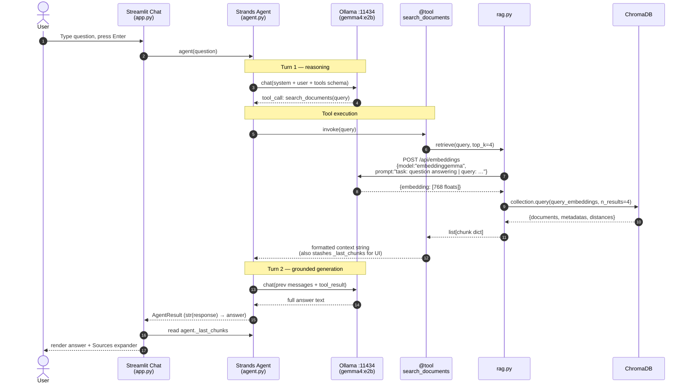
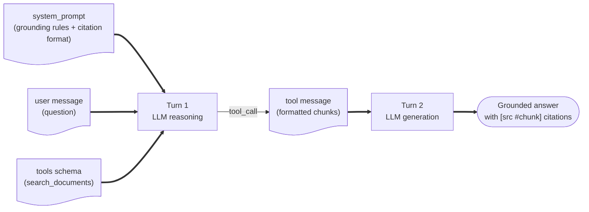

# Retrieval and Generation

The retrieval and generation pipeline takes a user's question, embeds it, finds the most similar document chunks in ChromaDB, hands them to a **Strands Agent** wrapping Gemma 4, and renders the agent's grounded answer in the Streamlit UI — all locally.

> **Architecture note.** The shipped app does **not** call `ollama.chat()` directly. Generation happens inside a Strands `Agent` whose system prompt instructs it to call a `search_documents` `@tool` first. That tool is what runs the embedding + Chroma query. See [Strands Agents →](../02-ecosystem/strands-agents.md) for the framework primer.

---

## Sequence Diagram



---

## The retrieval half — `rag.py`

`rag.py` owns query-time embedding and the Chroma lookup. **It does not generate** — generation happens via Strands.

```python
# rag.py
from pathlib import Path
import chromadb
import ollama

DB_DIR = Path(__file__).parent / "chroma_db"
COLLECTION = "proposals_gemma"
EMBED_MODEL = "embeddinggemma"

def embed_query(question: str) -> list[float]:
    # EmbeddingGemma's query-side task prefix
    prompt = f"task: question answering | query: {question}"
    return ollama.embeddings(model=EMBED_MODEL, prompt=prompt)["embedding"]

def get_collection():
    client = chromadb.PersistentClient(path=str(DB_DIR))
    return client.get_collection(COLLECTION)

def retrieve(question: str, top_k: int = 4) -> list[dict]:
    res = get_collection().query(
        query_embeddings=[embed_query(question)],
        n_results=top_k,
        include=["documents", "metadatas", "distances"],
    )
    return [
        {
            "doc": d,
            "source": m.get("source", "unknown"),
            "chunk_index": m.get("chunk_index", 0),
            "distance": dist,
        }
        for d, m, dist in zip(
            res["documents"][0], res["metadatas"][0], res["distances"][0]
        )
    ]
```

> **EmbeddingGemma prefixes matter.** Document-side embeddings (in `ingest.py`) use `title: none | text: {chunk}`. Query-side embeddings use `task: question answering | query: {question}`. Mixing the two degrades retrieval. See [Tokens & Embeddings](../01-foundations/tokens-and-embeddings.md) and the [embeddinggemma docs](https://ai.google.dev/gemma/docs/embeddinggemma).

---

## The generation half — `agent.py`

The agent wraps Gemma 4 in a Strands loop and exposes `search_documents` as the only tool. The system prompt enforces "always retrieve, then ground, then cite."

```python
# agent.py
from strands import Agent, tool
from strands.models.ollama import OllamaModel
import rag

GEN_MODEL = "gemma4:e2b"
OLLAMA_HOST = "http://localhost:11434"

# Module-level handoff for the UI's Sources expander.
_last_chunks: list[dict] = []

SYSTEM_PROMPT = """You are a helpful assistant that answers questions about engineering proposals.
Always call the search_documents tool first to retrieve relevant context before answering.
Answer ONLY using the information returned by the tool.
If the tool returns no relevant content, say "I could not find that in the provided documents."
Cite your sources using the format [source_filename.pdf #chunk_index] after each factual statement.
"""

@tool
def search_documents(query: str) -> str:
    """Search the indexed proposal documents for relevant information.

    Use this tool whenever a question is asked about the engineering proposals.

    Args:
        query: The search query used to find relevant document passages.

    Returns:
        Formatted document passages with source file names and chunk indices.
    """
    global _last_chunks
    chunks = rag.retrieve(query, top_k=4)
    _last_chunks = chunks
    if not chunks:
        return "No relevant documents found."
    return "\n\n".join(
        f"[{i}] Source: {c['source']} | Chunk #{c['chunk_index']}\n{c['doc']}"
        for i, c in enumerate(chunks, start=1)
    )

def create_agent() -> Agent:
    model = OllamaModel(host=OLLAMA_HOST, model_id=GEN_MODEL)
    return Agent(
        model=model,
        tools=[search_documents],
        system_prompt=SYSTEM_PROMPT,
    )
```

---

## Calling the agent from the UI

The Streamlit app keeps one `Agent` instance in `st.session_state` so the agent's internal message history survives across reruns. The call itself is **non-streaming** — Strands' `Agent.__call__` returns once the loop finishes.

```python
# app.py (excerpt)
import streamlit as st
import agent as agent_mod

if "strands_agent" not in st.session_state:
    st.session_state["strands_agent"] = agent_mod.create_agent()

if question := st.chat_input("Ask a question about your documents"):
    with st.chat_message("user"):
        st.markdown(question)

    with st.chat_message("assistant"):
        with st.spinner("Thinking…"):
            response = st.session_state["strands_agent"](question)
            answer = str(response)
        st.markdown(answer)

        # Sources expander reads the @tool's stashed chunks
        with st.expander("📚 Sources"):
            for c in agent_mod._last_chunks:
                st.write(
                    f"**{c['source']}** chunk #{c['chunk_index']} "
                    f"— distance {c['distance']:.3f}"
                )
```

> **Future enhancement: token streaming.** Strands and `OllamaModel` both support streaming, but the current Streamlit integration uses a single `agent(question)` call wrapped in `st.spinner("Thinking…")`. Switching to streamed deltas would require driving the agent's async stream API and writing tokens into `st.empty()` — a planned upgrade, not yet wired in.

---

## Relevance Scoring

ChromaDB returns **cosine distances** (0 = identical, 2 = opposite). The shipped app simply displays the raw distance. A friendlier similarity score is `1 - distance` (range 0…1):

| Similarity (`1 - distance`) | Interpretation |
|-----------|----------------|
| > 0.85 | Very relevant |
| 0.70–0.85 | Relevant |
| 0.50–0.70 | Loosely relevant |
| < 0.50 | Likely irrelevant |

> **Not yet implemented:** a `MIN_SIMILARITY` threshold filter inside `search_documents` to drop low-scoring chunks before handing them to the LLM. Adding it is a 3-line change inside the tool.

---

## Prompt Assembly (handled by Strands)



You never hand-build a prompt string here — the system prompt + tool schema are enough. That is the whole point of using an agent framework.

---

## Next Steps

- [Strands Agents →](../02-ecosystem/strands-agents.md) — agent loop, `@tool` schema, common pitfalls
- [Streamlit UI →](04-streamlit-ui.md) — the full interface including sidebar controls
- [Prompting & Temperature →](../01-foundations/prompting-and-temperature.md) — tuning generation
- [Evaluating RAG →](../05-operations/evaluating-rag.md) — measuring answer quality
