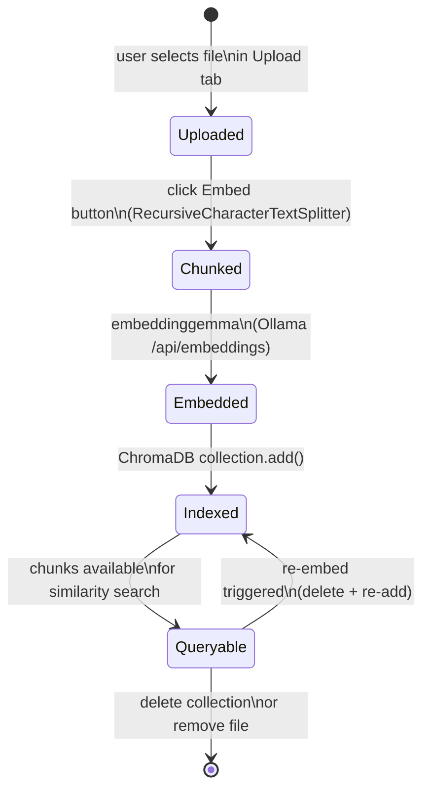

# Streamlit UI

> **⚠ Aspirational design — not yet implemented.**
> The shipped Local-RAG UI is a **single chat page** with a thin sidebar (`Re-ingest PDFs`, `Clear chat`, debug toggle, indexed-chunk count). The four-tab layout, sidebar sliders, Browse-ChromaDB tab, and file uploader described below are a planned upgrade — kept here as the reference design for that future enhancement. See [`../implementation/README.md`](../../implementation/README.md) for what actually ships today.

The Streamlit UI is the single entry-point for all interactions: uploading documents, triggering embedding, browsing what's in ChromaDB, chatting with the RAG agent, and tuning every model parameter through the sidebar — all in a browser tab at `localhost:8501`.

---

## UI Wireframe

```mermaid
flowchart TD
    accTitle: Streamlit UI wireframe — sidebar controls and four main tabs
    accDescr: The Streamlit page has a sidebar with all configurable parameters and a main area with four tabs for Upload, Embed, Browse ChromaDB, and Chat.

    subgraph sidebar ["◀ Sidebar — Model Controls"]
        direction TB
        s_title@{ shape: rect, label: "⚙️ Settings" }
        s_inf@{ shape: hex, label: "Inference Model\n(text input — default: gemma4:e2b)" }
        s_emb@{ shape: hex, label: "Embedding Model\n(text input — default: embeddinggemma)" }
        s_temp@{ shape: das, label: "Temperature\nslider 0.0 – 2.0 (default 0.2)" }
        s_topp@{ shape: das, label: "top_p\nslider 0.0 – 1.0 (default 0.9)" }
        s_topk@{ shape: das, label: "top_k (chunks to retrieve)\nslider 1 – 20 (default 5)" }
        s_chunk@{ shape: das, label: "Chunk Size (tokens)\nslider 128 – 2048 (default 512)" }
        s_overlap@{ shape: das, label: "Chunk Overlap (tokens)\nslider 0 – 256 (default 64)" }
        s_coll@{ shape: hex, label: "Collection Name\n(text input)" }
        s_status@{ shape: rect, label: "🟢 Ollama status indicator" }
        s_title --> s_inf --> s_emb --> s_temp --> s_topp --> s_topk --> s_chunk --> s_overlap --> s_coll --> s_status
    end

    subgraph main ["Main Area — Tabs"]
        direction TB
        tabs@{ shape: rect, label: "📤 Upload | ⚡ Embed | 🗄️ Browse ChromaDB | 💬 Chat" }

        subgraph tab_upload ["Tab: Upload"]
            up_widget@{ shape: subproc, label: "st.file_uploader\n(PDF, MD, TXT, DOCX\nmultiple=True)" }
            up_list@{ shape: docs, label: "Uploaded files list\nwith remove buttons" }
            up_widget --> up_list
        end

        subgraph tab_embed ["Tab: Embed"]
            em_files@{ shape: docs, label: "Files queued for embedding" }
            em_btn@{ shape: hex, label: "▶ Embed Documents button" }
            em_prog@{ shape: das, label: "st.progress bar\nper-file progress" }
            em_log@{ shape: doc, label: "Embedding log\n(chunks, time, model)" }
            em_files --> em_btn --> em_prog --> em_log
        end

        subgraph tab_browse ["Tab: Browse ChromaDB"]
            br_stats@{ shape: rect, label: "Collection stats\n(total chunks, sources)" }
            br_filter@{ shape: hex, label: "Filter by source file\n(selectbox)" }
            br_table@{ shape: docs, label: "Chunk table\n(id, source, text preview)" }
            br_del@{ shape: hex, label: "🗑️ Delete collection button" }
            br_stats --> br_filter --> br_table --> br_del
        end

        subgraph tab_chat ["Tab: Chat"]
            ch_hist@{ shape: docs, label: "st.chat_message history" }
            ch_input@{ shape: subproc, label: "st.chat_input\n'Ask a question…'" }
            ch_stream@{ shape: das, label: "Streamed answer tokens" }
            ch_sources@{ shape: doc, label: "📚 Sources expander\n(file, chunk, similarity)" }
            ch_hist --> ch_input --> ch_stream --> ch_sources
        end

        tabs --> tab_upload
        tabs --> tab_embed
        tabs --> tab_browse
        tabs --> tab_chat
    end
```



---

## Document Lifecycle



---

## Full `app.py`

```python
# app.py
from __future__ import annotations

import streamlit as st
import ollama as _ollama

from src.config import AppConfig
from src.db import get_collection, get_client
from src.ingest import ingest_file
from src.retrieval import answer_query

st.set_page_config(page_title="Local RAG", page_icon="🔍", layout="wide")

# ── Sidebar ──────────────────────────────────────────────────────────────────
with st.sidebar:
    st.title("⚙️ Settings")

    inference_model = st.text_input("Inference model", value="gemma4:e2b")
    embedding_model = st.text_input("Embedding model", value="embeddinggemma")
    temperature = st.slider("Temperature", 0.0, 2.0, 0.2, 0.05)
    top_p = st.slider("top_p", 0.0, 1.0, 0.9, 0.05)
    top_k = st.slider("top_k (chunks)", 1, 20, 5)
    chunk_size = st.slider("Chunk size (tokens)", 128, 2048, 512, 64)
    chunk_overlap = st.slider("Chunk overlap (tokens)", 0, 256, 64, 16)
    collection_name = st.text_input("Collection name", value="documents")

    # Ollama health check
    try:
        _ollama.list()
        st.success("🟢 Ollama running")
    except Exception:
        st.error("🔴 Ollama not reachable — run `ollama serve`")

config = AppConfig(
    inference_model=inference_model,
    embedding_model=embedding_model,
    temperature=temperature,
    top_p=top_p,
    top_k=top_k,
    chunk_size=chunk_size,
    chunk_overlap=chunk_overlap,
    collection_name=collection_name,
)
st.session_state["config"] = config

# ── Tabs ──────────────────────────────────────────────────────────────────────
tab_upload, tab_embed, tab_browse, tab_chat = st.tabs(
    ["📤 Upload", "⚡ Embed", "🗄️ Browse ChromaDB", "💬 Chat"]
)

# ── Upload tab ────────────────────────────────────────────────────────────────
with tab_upload:
    st.header("Upload Documents")
    uploaded_files = st.file_uploader(
        "Choose files", type=["pdf", "md", "txt", "docx"], accept_multiple_files=True
    )
    if uploaded_files:
        st.session_state["uploaded_files"] = uploaded_files
        for f in uploaded_files:
            st.write(f"📄 {f.name} ({f.size:,} bytes)")

# ── Embed tab ─────────────────────────────────────────────────────────────────
with tab_embed:
    st.header("Embed Documents into ChromaDB")
    files = st.session_state.get("uploaded_files", [])
    if not files:
        st.info("Upload files in the Upload tab first.")
    else:
        if st.button("▶ Embed Documents", type="primary"):
            progress = st.progress(0)
            log_area = st.empty()
            log_lines: list[str] = []
            for i, f in enumerate(files):
                n = ingest_file(f.read(), f.name, config, re_embed=True)
                log_lines.append(f"✓ {f.name} — {n} chunks embedded")
                log_area.code("\n".join(log_lines))
                progress.progress((i + 1) / len(files))
            st.success(f"Done! Embedded {len(files)} file(s).")

# ── Browse tab ────────────────────────────────────────────────────────────────
with tab_browse:
    st.header("Browse ChromaDB")
    collection = get_collection(config)
    total = collection.count()
    st.metric("Total chunks", total)

    if total > 0:
        all_items = collection.get(include=["documents", "metadatas"])
        sources = sorted({m.get("source", "?") for m in all_items["metadatas"]})
        selected_source = st.selectbox("Filter by source", ["(all)"] + sources)

        rows = []
        for id_, doc, meta in zip(
            all_items["ids"], all_items["documents"], all_items["metadatas"]
        ):
            if selected_source != "(all)" and meta.get("source") != selected_source:
                continue
            rows.append({
                "id": id_[:8],
                "source": meta.get("source", "?"),
                "chunk": meta.get("chunk_index", "?"),
                "preview": doc[:100].replace("\n", " "),
            })
        st.dataframe(rows, use_container_width=True)

        if st.button("🗑️ Delete entire collection", type="secondary"):
            get_client(config).delete_collection(config.collection_name)
            st.rerun()

# ── Chat tab ──────────────────────────────────────────────────────────────────
with tab_chat:
    st.header("Chat with Your Documents")

    if "messages" not in st.session_state:
        st.session_state["messages"] = []

    for msg in st.session_state["messages"]:
        with st.chat_message(msg["role"]):
            st.markdown(msg["content"])

    if prompt := st.chat_input("Ask a question about your documents…"):
        st.session_state["messages"].append({"role": "user", "content": prompt})
        with st.chat_message("user"):
            st.markdown(prompt)

        with st.chat_message("assistant"):
            placeholder = st.empty()
            full_response = ""
            sources = []
            gen = answer_query(
                prompt, config, st.session_state["messages"][:-1]
            )
            try:
                while True:
                    token = next(gen)
                    full_response += token
                    placeholder.markdown(full_response + "▌")
            except StopIteration as exc:
                sources = exc.value or []
            placeholder.markdown(full_response)

            if sources:
                with st.expander("📚 Sources"):
                    for s in sources:
                        st.write(
                            f"**{s['source']}** — chunk {s['chunk']} "
                            f"(similarity: {s['score']})"
                        )

        st.session_state["messages"].append(
            {"role": "assistant", "content": full_response}
        )
```

---

## Next Steps

- [Running & Testing →](05-running-and-testing.md) — start the app and run smoke tests  
- [Retrieval & Generation →](03-retrieval-and-generation.md) — what happens when you send a chat message  
- [Performance Tuning →](../05-operations/performance-tuning.md) — making the UI feel faster
