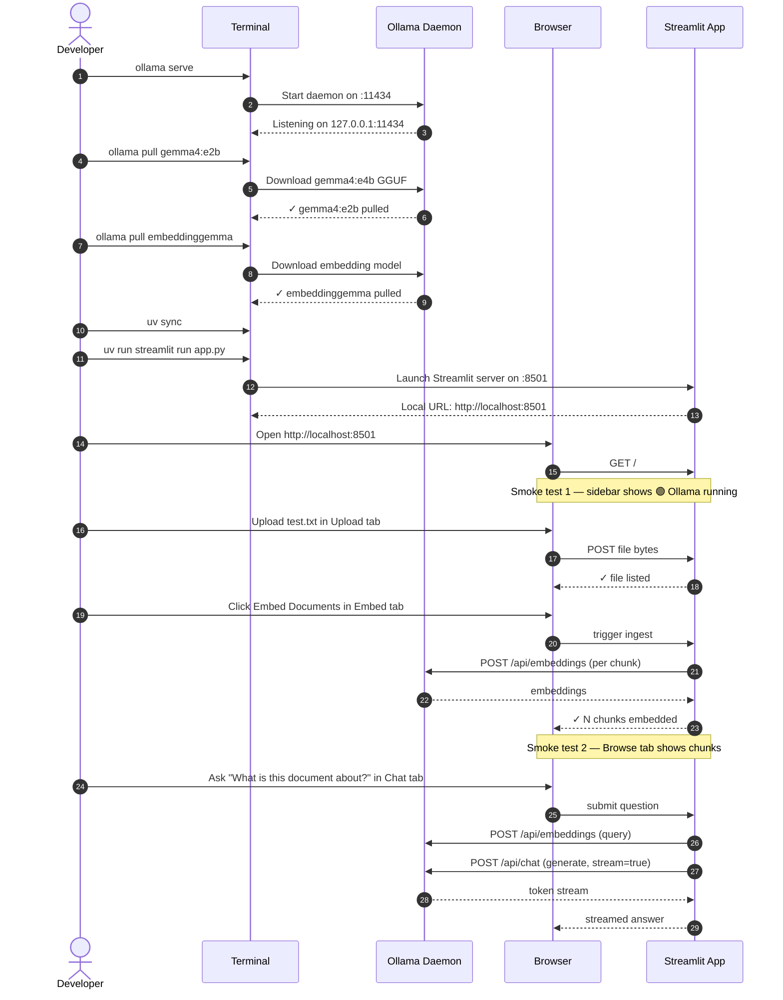

# Running and Testing

Two commands start the full app. This page walks through the dev loop, explains the startup sequence, and gives you smoke tests to verify everything is working before you start asking real questions.

---

## Startup Sequence



---

## Step-by-Step Commands

### 1. Start Ollama

```bash
# macOS / Linux — if not already running as a service
ollama serve
```

On Windows, Ollama starts automatically in the system tray after installation.

### 2. Pull models (first time only)

```bash
ollama pull gemma4:e2b              # ~5 GB — the inference model
ollama pull embeddinggemma    # ~622 MB — the embedding model
```

Verify:
```bash
ollama list
# NAME                   ID            SIZE    MODIFIED
# gemma4:latest          …             5.0 GB  …
# embeddinggemma:latest …            622 MB  …
```

### 3. Sync the project environment with uv

```powershell
cd Local-RAG
uv sync                          # creates .venv from pyproject.toml + uv.lock
```

No manual venv activation needed — every command runs through `uv run`.

### 4. Start Streamlit

```powershell
uv run streamlit run app.py
```

Open [http://localhost:8501](http://localhost:8501) in your browser.

---

## Smoke Tests

### Test 1 — Ollama health

The sidebar shows **🟢 Ollama running**. If it shows 🔴, `ollama serve` is not running or a firewall is blocking `localhost:11434`.

### Test 2 — Embedding a file

Create a minimal test file:

```bash
echo "The sky is blue. Cats like fish. Python is a programming language." > /tmp/test.txt
```

1. Upload `test.txt` in the **Upload** tab.
2. Click **Embed Documents** in the **Embed** tab.
3. Switch to **Browse ChromaDB** — you should see 1–3 chunks.

### Test 3 — RAG query

In the **Chat** tab, ask:

```
What do cats like?
```

Expected: The answer mentions "fish" and cites `test.txt` as the source. If Gemma 4 invents an answer not in the document, your system prompt or temperature may need tuning.

### Test 4 — Python CLI smoke test

```powershell
uv run python - <<'EOF'
import ollama, chromadb

# Test Ollama embeddings
r = ollama.embeddings(model="embeddinggemma", prompt="hello world")
assert len(r["embedding"]) == 768, "Expected 768-dim embedding"
print("✓ embeddinggemma embedding OK")

# Test Gemma 4 generation
stream = ollama.chat(
    model="gemma4:e2b",
    messages=[{"role": "user", "content": "Say 'hello' and nothing else."}],
    options={"temperature": 0.0, "num_predict": 10},
    stream=True,
)
response = "".join(c["message"]["content"] for c in stream)
print(f"✓ Gemma 4 response: {response.strip()}")

# Test ChromaDB
client = chromadb.PersistentClient(path="/tmp/smoke_test_chroma")
col = client.get_or_create_collection("test")
col.add(ids=["1"], embeddings=[r["embedding"]], documents=["hello world"])
result = col.query(query_embeddings=[r["embedding"]], n_results=1)
assert result["documents"][0][0] == "hello world"
print("✓ ChromaDB write + query OK")
import shutil; shutil.rmtree("/tmp/smoke_test_chroma")
EOF
```

All three checks should print `✓`.

---

## Common Startup Errors

| Error | Cause | Fix |
|-------|-------|-----|
| `ConnectionError: [Errno 111] Connection refused` | `ollama serve` not running | Run `ollama serve` in a separate terminal |
| `ResponseError: model not found` | Model not pulled | `ollama pull gemma4:e2b` |
| `OSError: [Errno 98] Address already in use` | Port 8501 occupied | `uv run streamlit run app.py --server.port 8502` |
| `ModuleNotFoundError: No module named 'chromadb'` | env out of sync | `uv sync` (or run via `uv run …`) |
| ChromaDB `SegmentationFault` on first run | Outdated hnswlib | `uv lock --upgrade-package chromadb && uv sync` |

See [Troubleshooting →](../05-operations/troubleshooting.md) for a full decision tree.

---

## Reloading After Code Changes

Streamlit auto-reloads when you save a Python file. If you change `pyproject.toml`, restart manually:

```powershell
# Ctrl+C to stop Streamlit
uv sync
uv run streamlit run app.py
```

---

## Next Steps

- [Troubleshooting →](../05-operations/troubleshooting.md) — fixing errors  
- [Performance Tuning →](../05-operations/performance-tuning.md) — faster inference  
- [Evaluating RAG →](../05-operations/evaluating-rag.md) — measuring answer quality
