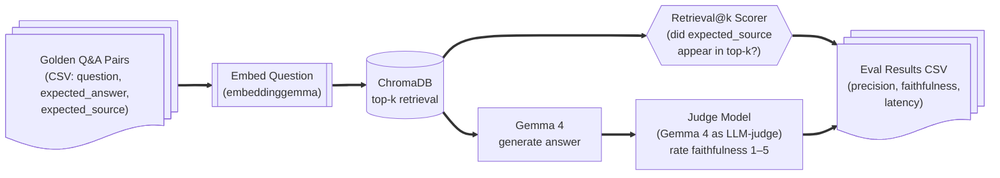
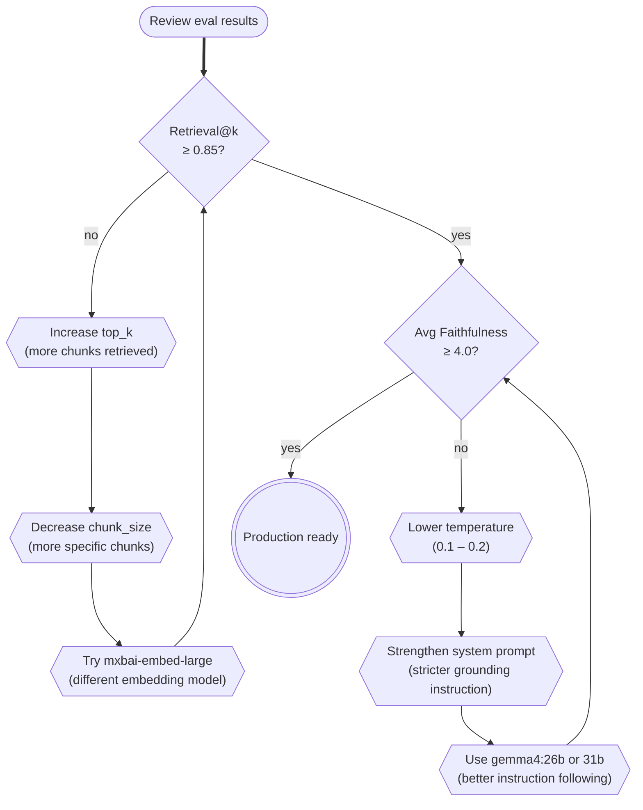

# Evaluating RAG

Building a RAG app is easy; knowing whether it's *good* is hard. This page covers the two key metrics — **retrieval quality** and **answer faithfulness** — and shows you how to build a minimal eval harness you can run locally.

---

## Eval Harness Overview



---

## Metric Definitions

### Retrieval@k (Recall)

_Did the ground-truth source document appear in the top-k retrieved chunks?_

```
Retrieval@k = (queries where source in top-k) / total_queries
```

A score of 0.9 means 90 % of the time the relevant document was retrieved. Aim for > 0.85 before worrying about answer quality.

### Faithfulness

_Is every claim in the generated answer supported by the retrieved context?_

Scored 1–5 by a "judge" LLM prompt:
- **5** — All claims fully supported by context
- **4** — Most claims supported; minor gaps
- **3** — Some claims unsupported
- **2** — Majority of claims unsupported
- **1** — Answer contradicts or ignores context (hallucination)

---

## Building the Harness

### Golden dataset format

```csv
question,expected_answer,expected_source
"What is ChromaDB?","An embedded vector database","chromadb.md"
"How do I pull Gemma 4?","ollama pull gemma4:e2b","ollama.md"
"What does top_p control?","Nucleus sampling threshold","prompting-and-temperature.md"
```

### Eval script

```python
# eval/run_eval.py
from __future__ import annotations

import csv
import time
from pathlib import Path

import ollama

from src.config import AppConfig
from src.retrieval import retrieve_chunks, answer_query

GOLDEN_CSV = Path("eval/golden.csv")
RESULTS_CSV = Path("eval/results.csv")

FAITHFULNESS_PROMPT = """You are a strict evaluator. Rate the faithfulness of the answer
on a scale of 1-5, where 5 means every claim is fully supported by the provided context
and 1 means the answer contradicts or ignores the context.

Context:
{context}

Question: {question}
Answer: {answer}

Reply with ONLY a single integer (1-5) and nothing else."""


def score_faithfulness(question: str, context: str, answer: str) -> int:
    prompt = FAITHFULNESS_PROMPT.format(
        context=context, question=question, answer=answer
    )
    resp = ollama.chat(
        model="gemma4:e2b",
        messages=[{"role": "user", "content": prompt}],
        options={"temperature": 0.0, "num_predict": 5},
        stream=False,
    )
    try:
        return int(resp["message"]["content"].strip()[0])
    except (ValueError, IndexError):
        return 0


def run_eval(config: AppConfig) -> None:
    rows: list[dict] = []

    with GOLDEN_CSV.open() as f:
        reader = csv.DictReader(f)
        cases = list(reader)

    for case in cases:
        question = case["question"]
        expected_source = case["expected_source"]

        start = time.perf_counter()
        docs, metas, dists = retrieve_chunks(question, config)
        retrieved_sources = [m.get("source", "") for m in metas]
        hit = expected_source in retrieved_sources

        # Generate answer
        gen = answer_query(question, config)
        answer_tokens: list[str] = []
        try:
            while True:
                answer_tokens.append(next(gen))
        except StopIteration:
            pass
        answer = "".join(answer_tokens)
        latency = time.perf_counter() - start

        # Score faithfulness
        from src.retrieval import _format_context  # noqa: PLC0415
        context = _format_context(docs, metas)
        faith = score_faithfulness(question, context, answer)

        rows.append({
            "question": question,
            "hit": hit,
            "faithfulness": faith,
            "latency_s": round(latency, 2),
            "answer_preview": answer[:80].replace("\n", " "),
        })
        print(f"{'✓' if hit else '✗'} | faith={faith} | {question[:50]}")

    # Summary
    total = len(rows)
    retrieval_at_k = sum(r["hit"] for r in rows) / total
    avg_faith = sum(r["faithfulness"] for r in rows) / total
    avg_latency = sum(r["latency_s"] for r in rows) / total

    print(f"\nRetrieval@{config.top_k}: {retrieval_at_k:.2%}")
    print(f"Avg Faithfulness:  {avg_faith:.2f}/5")
    print(f"Avg Latency:       {avg_latency:.1f}s")

    with RESULTS_CSV.open("w", newline="") as f:
        writer = csv.DictWriter(f, fieldnames=rows[0].keys())
        writer.writeheader()
        writer.writerows(rows)

if __name__ == "__main__":
    run_eval(AppConfig())
```

Run it:
```bash
python -m eval.run_eval
```

---

## Interpreting Results



---

## Next Steps

- [Performance Tuning →](performance-tuning.md) — improve latency after fixing quality  
- [Prompting & Temperature →](../01-foundations/prompting-and-temperature.md) — tuning the generation parameters  
- [Troubleshooting →](troubleshooting.md) — fixing errors that break the eval harness
