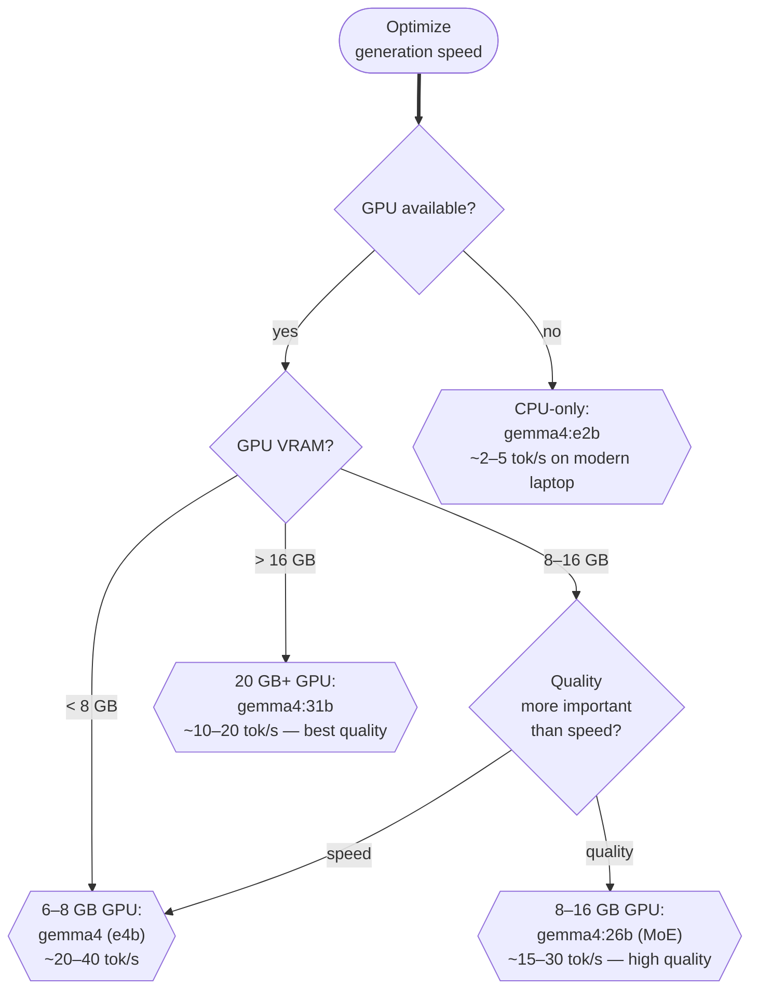

# Performance Tuning

A local RAG app on consumer hardware can feel sluggish when embedding large document sets or generating long answers. This guide covers the most impactful levers — from model quantization and GPU offload to async embedding and context window budgeting.

---

## Where Time Goes

```mermaid
flowchart LR
    accTitle: Performance bottlenecks in the local RAG pipeline
    accDescr: Shows the three main stages where latency accumulates — embedding, ChromaDB search, and generation — and the relative cost of each.

    upload@{ shape: doc, label: "File Upload\n(negligible)" }
    parse@{ shape: subproc, label: "Parse + Chunk\n(fast — CPU only)" }
    embed_loop@{ shape: das, label: "Embedding Loop\n⚠️ BOTTLENECK\nN × Ollama HTTP round-trip" }
    chroma_write@{ shape: cyl, label: "ChromaDB Write\n(fast — local I/O)" }
    query_embed@{ shape: subproc, label: "Query Embed\n(1 call — fast)" }
    ann_search@{ shape: cyl, label: "ANN Search\n(fast — HNSW in memory)" }
    generate@{ shape: rect, label: "Gemma 4 Generate\n⚠️ BOTTLENECK\ntime-to-first-token + TPS" }

    upload ==> parse ==> embed_loop ==> chroma_write
    chroma_write -.-> query_embed
    query_embed ==> ann_search ==> generate
```



The two bottlenecks are:
1. **Embedding loop** — sequential HTTP calls to Ollama, one per chunk.
2. **Gemma 4 generation** — constrained by VRAM / RAM bandwidth.

---

## 1. Batch Embeddings with Async

Replace the sequential embedding loop with concurrent requests:

```python
# src/ingest_async.py
import asyncio
import httpx

OLLAMA_URL = "http://localhost:11434/api/embeddings"
CONCURRENCY = 8  # tune based on VRAM — start with 4, increase until VRAM OOM

async def embed_chunk(client: httpx.AsyncClient, model: str, text: str) -> list[float]:
    resp = await client.post(OLLAMA_URL, json={"model": model, "prompt": text})
    resp.raise_for_status()
    return resp.json()["embedding"]

async def embed_all(chunks: list[str], model: str) -> list[list[float]]:
    sem = asyncio.Semaphore(CONCURRENCY)

    async def bounded(text: str) -> list[float]:
        async with sem:
            return await embed_chunk(client, model, text)

    async with httpx.AsyncClient(timeout=60.0) as client:
        return await asyncio.gather(*[bounded(c) for c in chunks])

# Call from sync code:
embeddings = asyncio.run(embed_all(chunks, "embeddinggemma"))
```

Typical speedup: **4–8× faster** for a 500-chunk document on a GPU machine.

---

## 2. Choose the Right Gemma 4 Variant



---

## 3. GPU Offload Layers

Ollama automatically detects and uses GPUs, but you can control how many layers are offloaded:

```bash
# Set via environment variable before starting Ollama
OLLAMA_NUM_GPU=99 ollama serve   # offload all layers (default when GPU detected)
OLLAMA_NUM_GPU=0  ollama serve   # force CPU-only
OLLAMA_NUM_GPU=20 ollama serve   # partial offload — splits across CPU+GPU
```

Partial offload is useful when the model is slightly larger than VRAM — most layers run on GPU, a few on CPU, still much faster than pure CPU inference.

---

## 4. Context Window Budget

Generating with a 128K context window is much slower than a 4K window. Limit retrieved context:

```python
MAX_CONTEXT_TOKENS = 4_000   # plenty for 5 chunks of 512 tokens
TOP_K = 5
CHUNK_SIZE = 512
# Total: 5 × 512 = 2560 tokens + system prompt overhead ≈ 3 200 tokens
```

Also set `num_predict` to limit answer length:

```python
options = {
    "temperature": 0.2,
    "num_predict": 512,    # max tokens to generate
    "num_ctx": 4096,       # override context window size
}
```

---

## 5. Quantization Trade-offs

| Quantization | Size (gemma4:e2b e4b) | VRAM | Tok/s (RTX 4070) | Quality |
|---|---|---|---|---|
| F16 | ~9 GB | ~10 GB | ~25 | Reference |
| Q8_0 | ~5 GB | ~6 GB | ~30 | ≈ F16 |
| **Q4_K_M** | ~3 GB | ~4 GB | ~45 | Excellent |
| Q4_0 | ~2.8 GB | ~3.5 GB | ~50 | Good |
| Q2_K | ~1.5 GB | ~2 GB | ~60 | Noticeable loss |

The default `gemma4:e2b` pull uses **Q4_K_M** — you get ~45 tokens/second with only minor quality loss vs full precision.

---

## 6. ChromaDB Performance

For collections with > 100 000 chunks, tune HNSW at collection creation:

```python
collection = client.get_or_create_collection(
    name="large_corpus",
    metadata={
        "hnsw:space": "cosine",
        "hnsw:construction_ef": 200,   # build quality (default 100)
        "hnsw:search_ef": 100,          # query quality (default 10)
        "hnsw:M": 32,                   # graph connectivity (default 16)
    },
)
```

> Setting `search_ef` too high makes queries slow. For RAG with `top_k ≤ 10`, `search_ef = 50` is a reasonable maximum.

---

## Next Steps

- [Evaluating RAG →](evaluating-rag.md) — measuring whether tuning helped  
- [Gemma 4 Models →](../02-ecosystem/gemma-models.md) — variant details  
- [Troubleshooting →](troubleshooting.md) — OOM and GPU errors
