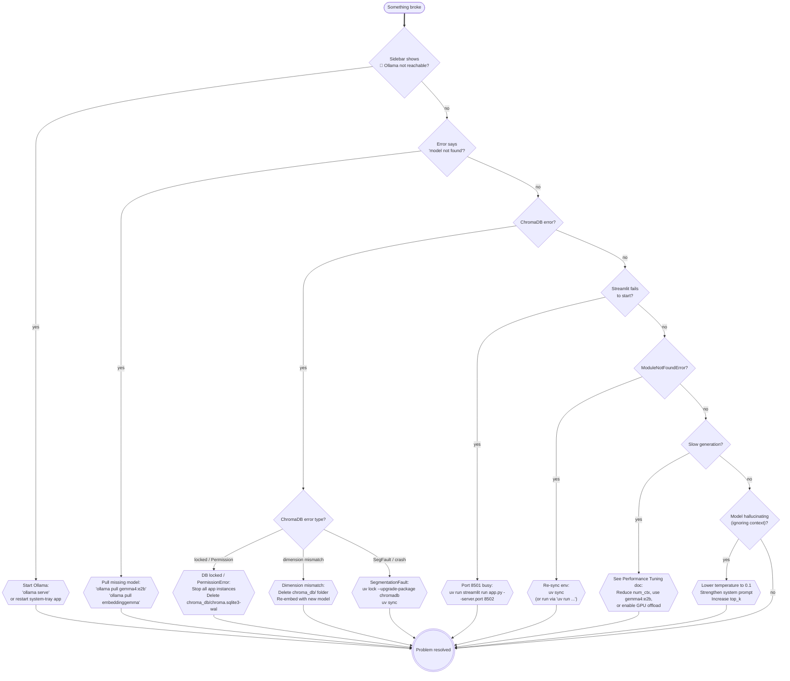
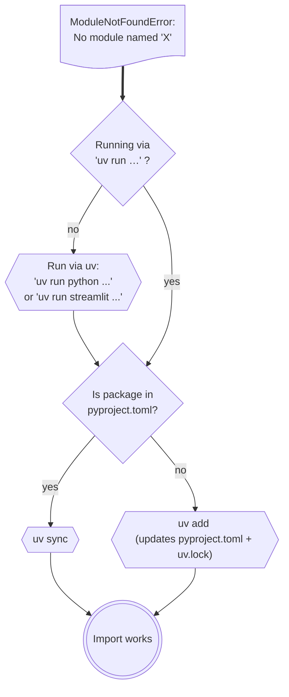

# Troubleshooting

A decision tree for every common error you'll hit running the local RAG app — from Ollama not starting to ChromaDB file locks and Streamlit port conflicts.

---

## Master Error Decision Tree



---

## Error Reference

### Ollama errors

| Error message | Cause | Fix |
|---|---|---|
| `ConnectionError: [Errno 111] Connection refused` | Ollama daemon not running | `ollama serve` in a terminal |
| `ResponseError: model "gemma4:e2b" not found` | Model not pulled | `ollama pull gemma4:e2b` |
| `ResponseError: model "embeddinggemma" not found` | Embedding model not pulled | `ollama pull embeddinggemma` |
| `CUDA out of memory` | VRAM exhausted | Switch to `gemma4:e2b` or set `OLLAMA_NUM_GPU=0` for CPU |
| Ollama hangs / no response | Model loading (first run) | Wait 30–60 s for GGUF to load into VRAM |

### ChromaDB errors

| Error | Cause | Fix |
|---|---|---|
| `sqlite3.OperationalError: database is locked` | Two app instances open | Kill all Python processes: `pkill -f streamlit` |
| `InvalidDimensionException` | Switched embedding models after first embed | Delete `./chroma_db/` and re-embed |
| `SegmentationFault` on startup | Stale hnswlib binary | `uv lock --upgrade-package chromadb && uv sync` |
| `FileNotFoundError: chroma_db/` | Path doesn't exist | `mkdir chroma_db` or check `CHROMA_PATH` in `.env` |

### Streamlit errors

| Error | Cause | Fix |
|---|---|---|
| `OSError: [Errno 98] Address already in use` | Port 8501 occupied | `--server.port 8502` flag |
| `DuplicateWidgetID` | Widgets created inside loops without unique keys | Add `key=f"widget_{i}"` to each widget |
| Page resets on every interaction | `st.rerun()` called unconditionally | Guard rerun calls with a state condition |
| `StreamlitAPIException: no active script run ctx` | Calling Streamlit outside the main thread | Move Ollama/Chroma calls into the main thread |

### Python environment errors



---

## Diagnostic Commands

```bash
# Is Ollama running?
curl http://localhost:11434/api/tags

# List loaded models (in VRAM)
ollama ps

# Check ChromaDB file sizes
du -sh ./chroma_db/

# What Python is active?
uv run python --version

# What packages are installed?
uv pip list | Select-String "chromadb|ollama|streamlit"

# Streamlit logs
uv run streamlit run app.py --logger.level debug
```

---

## Next Steps

- [Performance Tuning →](performance-tuning.md) — if the app is slow but working  
- [Running & Testing →](../04-build-the-app/05-running-and-testing.md) — smoke tests to verify your setup  
- [Evaluating RAG →](evaluating-rag.md) — if answers are poor quality
