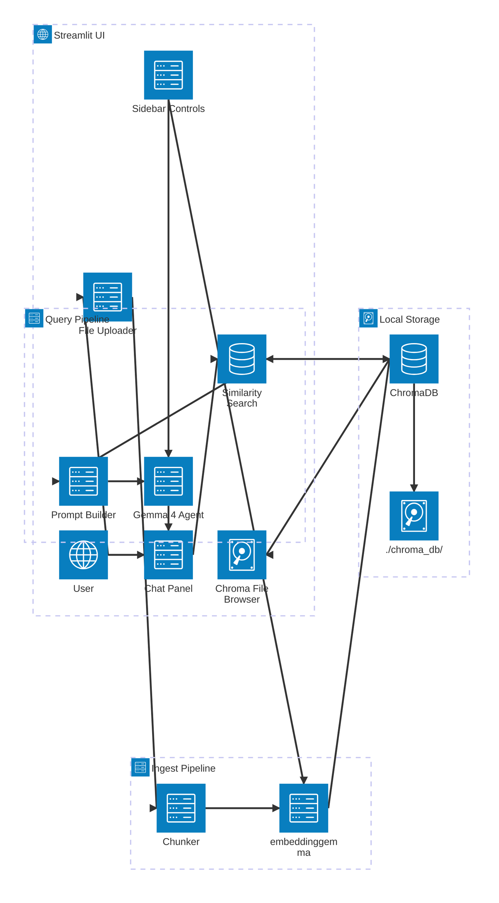

# Local RAG Application — Theory & Reference

> **What this folder is.** A general teaching reference covering RAG fundamentals, the local-first ecosystem (Ollama, ChromaDB, embeddings, sampling), and the architecture of a *fully-featured* Streamlit RAG app. It is the **aspirational design** that the code in this repo was built from.
>
> **What this folder is NOT.** A line-for-line description of the shipped code. The implementation in [`../implementation/`](../implementation/README.md) is narrower and uses different model choices, a Strands-agent loop, and a simpler UI. See the **Implementation Status** table below for the deltas.
>
> **Package manager.** Every command in this folder uses [`uv`](https://docs.astral.sh/uv/) — never `pip` or raw `python -m venv`.

---

## Implementation Status — Theory vs Shipped Code

The theory has been re-aligned with the shipped code on model choices, agent layer, project layout, and the non-streaming generation flow. Items below marked **Not implemented (planned)** describe deliberately aspirational extras that the shipped code intentionally omits — each of those theory pages calls out the gap inline.

| Topic | Theory says | Shipped code does | Status |
|---|---|---|---|
| Embedding model | `embeddinggemma` (768-d, 2 048-tok ctx, with `title:` / `task:` prefixes) | Same | **Aligned** |
| Generation model | `gemma4:e2b` | Same | **Aligned** |
| Agent layer | **Strands Agents** loop with a `search_documents` `@tool` | Same | **Aligned** |
| Project layout | Flat: `app.py`, `agent.py`, `rag.py`, `ingest.py` | Same | **Aligned** |
| Streaming | Non-streaming `agent(question)` call returning a full `AgentResult` | Same | **Aligned** |
| Document sources | UI file uploader supporting **PDF / MD / TXT / DOCX** | PDFs only, dropped into `raw-files/` | **Not implemented (planned)** — see [`04-build-the-app/02-ingestion-pipeline.md`](04-build-the-app/02-ingestion-pipeline.md) |
| Streamlit UI | 4 tabs (Upload, Embed, Browse ChromaDB, Chat) + sidebar sliders for temperature / top_p / top_k / chunk_size / chunk_overlap / model picker | Single chat page; sidebar with `Re-ingest PDFs`, `Clear chat`, debug toggle | **Not implemented (planned)** — see [`04-build-the-app/04-streamlit-ui.md`](04-build-the-app/04-streamlit-ui.md) |
| Config | `AppConfig` dataclass + `.env` (`python-dotenv`) | Hard-coded module constants | **Not implemented (planned)** |
| Chunking | `RecursiveCharacterTextSplitter` with HF tokenizer-based length function (512 tok / 64 overlap) | Naive character sliding window (1 200 chars / 200 overlap) | **Not implemented (planned)** — see [`01-foundations/chunking-strategies.md`](01-foundations/chunking-strategies.md) |
| HF tokenizer cache (`models/`) | Used for accurate token counts | Not used | **Not implemented (planned)** |
| Async / batched embeddings | `httpx.AsyncClient` + `Semaphore(8)` | Synchronous, one HTTP call per chunk | **Not implemented (planned)** — see [`05-operations/performance-tuning.md`](05-operations/performance-tuning.md) |
| Re-embedding granularity | Per-source delete (`where={"source": filename}`) | Whole-collection wipe and rebuild | **Not implemented (planned)** |
| Browse-ChromaDB tab | Full chunk table + per-source filter + delete-collection button | None — only an "Indexed chunks" counter and per-answer Sources expander | **Not implemented (planned)** |
| Sources panel | Similarity score `1 - distance` (0–1) | Raw cosine distance (0–2) | **Not implemented (planned)** |
| Relevance threshold filter | `MIN_SIMILARITY = 0.60` filter on retrieved chunks | None | **Not implemented (planned)** |
| Eval harness (`eval/run_eval.py`) | Golden CSV + `Retrieval@k` + LLM-judge faithfulness 1–5 | None | **Not implemented (planned)** — see [`05-operations/evaluating-rag.md`](05-operations/evaluating-rag.md) |
| Multimodal / image upload | Mentioned as possible | Not exposed | **Not implemented (planned)** |

> Every "planned" entry is something Copilot can add — open an issue or ask in chat.

---

## High-Level Architecture (theoretical)

The diagram below shows the two core flows — document ingestion and RAG querying — and how the Streamlit UI connects them.



---

## What You Will Learn

```mermaid
timeline
    accTitle: Learning path through the local-RAG documentation
    accDescr: Seven stages from concepts through operations, building up to a running Streamlit RAG app.
    section Concepts
        What is RAG : RAG vs plain LLM
                    : When to use retrieval
    section Foundations
        Tokens & Embeddings : How text becomes vectors
        Chunking : Splitting strategies
        Sampling : Temperature, top_p, top_k
    section Ecosystem
        Hugging Face : Model Hub and cards
        Ollama : Local model runner
        Gemma 4 : Inference model
        EmbeddingGemma : Embedding model
        ChromaDB : Vector store
        Strands Agents : Agent loop and tools
    section Environment
        Python Setup : venv / uv
        Dependencies : Pinned packages
    section Build
        Project Layout : Folder structure
        Ingestion Pipeline : Upload → embed → store
        Retrieval & Generation : Query → search → answer
        Streamlit UI : Full interface guide
        Running & Testing : Dev loop
    section Operations
        Performance Tuning : Quantization, GPU
        Evaluating RAG : Metrics, eval harness
        Troubleshooting : Common errors
    section Reference
        Glossary : Key terms
        Further Reading : Curated links
```



---

## Quick Navigation

| Section | Doc | What it covers |
|---------|-----|----------------|
| **Overview** | [What is RAG?](00-overview/what-is-rag.md) | RAG concepts; retrieval vs fine-tuning |
| | [Architecture](00-overview/architecture.md) | Detailed system diagram + C4 container view |
| **Foundations** | [Tokens & Embeddings](01-foundations/tokens-and-embeddings.md) | Tokenization, vector math, similarity |
| | [Chunking Strategies](01-foundations/chunking-strategies.md) | Fixed, recursive, semantic; overlap trade-offs |
| | [Prompting & Temperature](01-foundations/prompting-and-temperature.md) | Sampling parameters, system prompts |
| **Ecosystem** | [Hugging Face](02-ecosystem/hugging-face.md) | Hub, model cards, HF CLI |
| | [Ollama](02-ecosystem/ollama.md) | Install, pull, run, REST API |
| | [Gemma 4 Models](02-ecosystem/gemma-models.md) | Sizes, quantization, license |
| | [ChromaDB](02-ecosystem/chromadb.md) | Collections, persistence, metadata filters |
| | [Strands Agents](02-ecosystem/strands-agents.md) | Agent loop, `@tool` decorator, `OllamaModel` |
| **Python Setup** | [Environment](03-python-setup/environment.md) | Python version, venv/uv |
| | [Dependencies](03-python-setup/dependencies.md) | Pinned packages, OS notes |
| **Build** | [Project Layout](04-build-the-app/01-project-layout.md) | Folder structure |
| | [Ingestion Pipeline](04-build-the-app/02-ingestion-pipeline.md) | Upload → chunk → embed → store |
| | [Retrieval & Generation](04-build-the-app/03-retrieval-and-generation.md) | Query → search → answer |
| | [Streamlit UI](04-build-the-app/04-streamlit-ui.md) | UI guide, sidebar controls |
| | [Running & Testing](04-build-the-app/05-running-and-testing.md) | Dev loop, smoke tests |
| **Operations** | [Performance Tuning](05-operations/performance-tuning.md) | Quantization, GPU offload |
| | [Evaluating RAG](05-operations/evaluating-rag.md) | Retrieval@k, faithfulness |
| | [Troubleshooting](05-operations/troubleshooting.md) | Error decision tree |
| **Reference** | [Glossary](06-reference/glossary.md) | All key terms |
| | [Further Reading](06-reference/further-reading.md) | Links to official docs |

---

## Prerequisites

- Python 3.11 or 3.12
- 8 GB RAM minimum (16 GB recommended)
- 6–10 GB free disk space (models + ChromaDB)
- Ollama installed ([→ Ollama guide](02-ecosystem/ollama.md))
- Models pulled:
  ```powershell
  ollama pull gemma4:e2b      # inference
  ollama pull embeddinggemma  # embeddings (~622 MB)
  ```

> **Note:** these are the same models the shipped app uses — see [`../implementation/setup.md`](../implementation/setup.md).

> **Start here →** [What is RAG?](00-overview/what-is-rag.md)
